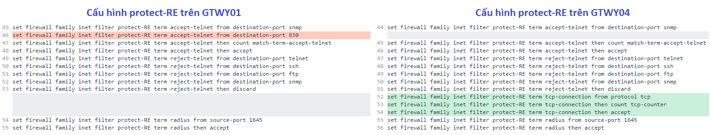

# SR-2022-0408-1059 - QTSC/Ngoài HĐ/Hỗ trợ kiểm tra lỗi Minor backup RE active trên MX960

---

**Phát sinh: RE0 bị reboot gây switchover vai trò master sang RE1**

---

**Ghi nhận ban đầu**

- Trên DC-L36-GTWY04 ghi nhận RE0 bị reboot gây switchover vai trò master sang RE1

```
root@DC-L36-GTWY04> show chassis routing-engine | match "Slot|State|Start"
  Slot 0:
    Current state                  Backup
    Start time                     2022-04-03 08:29:18 ICT
  Slot 1:
    Current state                  Master
    Start time                     2021-08-01 13:05:36 ICT
```

```
root@DC-L36-GTWY04> show chassis alarms no-forwarding

1 alarms currently active
Alarm time               Class  Description
2022-04-03 08:28:45 ICT  Minor  Backup RE Active
```

- Phát sinh coredumps trên RE0 tại đúng thời điểm RE0 bị reboot

```
root@DC-L36-GTWY04> show system core-dumps no-forwarding

-rw-------  1 root  wheel  1403523072 Jul 29  2021 /var/crash/vmcore.0
-rw-------  1 root  wheel  1332736000 Aug 1   2021 /var/crash/vmcore.1
-rw-------  1 root  wheel  1373450240 Apr 3  08:31 /var/crash/vmcore.2
lrwxr-xr-x  1 root  wheel          8 Apr 3  08:31 /var/crash/vmcore.last@ -> vmcore.2
/var/tmp/*core*: No such file or directory
/var/tmp/pics/*core*: No such file or directory
/var/crash/kernel.*: No such file or directory
/var/jails/rest-api/tmp/*core*: No such file or directory
/tftpboot/corefiles/*core*: No such file or directory
total files: 4
```

- Logs trên thiết bị tại thời điểm phát sinh ghi nhân nhiều log bị quét port ssh. Kiểm tra trên các thiết bị cùng chức năng thì có GTWY03 cũng có log quét port ssh tương tự. Tuy nhiên, GTWY01 và GTWY02 không xuất hiện log tương tự.

```
Apr  3 08:27:50  DC-L36-GTWY04 sshd[30062]: Failed password for mpcl from 106.51.66.192 port 54888 ssh2
Apr  3 08:27:50  DC-L36-GTWY04 sshd: SSHD_LOGIN_FAILED: Login failed for user 'mpcl' from host '106.51.66.192'
Apr  3 08:27:51  DC-L36-GTWY04 sshd[30062]: Received disconnect from 106.51.66.192: 11: Bye Bye [preauth]
Apr  3 08:27:51  DC-L36-GTWY04 sshd[30063]: Received disconnect from 106.51.66.192: 11: Bye Bye
Apr  3 08:27:51  DC-L36-GTWY04 sshd[30062]: Disconnected from 106.51.66.192 [preauth]
Apr  3 08:27:51  DC-L36-GTWY04 inetd[9988]: /usr/sbin/sshd[30062]: exited, status 255
Apr  3 08:27:53  DC-L36-GTWY04 sshd[30066]: Failed password for arunav from 120.48.17.128 port 38948 ssh2
Apr  3 08:27:53  DC-L36-GTWY04 sshd: SSHD_LOGIN_FAILED: Login failed for user 'arunav' from host '120.48.17.128'
Apr  3 08:27:53  DC-L36-GTWY04 sshd[30066]: Received disconnect from 120.48.17.128: 11: Bye Bye [preauth]
Apr  3 08:27:53  DC-L36-GTWY04 sshd[30067]: Received disconnect from 120.48.17.128: 11: Bye Bye
Apr  3 08:27:53  DC-L36-GTWY04 sshd[30066]: Disconnected from 120.48.17.128 [preauth]
Apr  3 08:27:53  DC-L36-GTWY04 inetd[9988]: /usr/sbin/sshd[30066]: exited, status 255
Apr  3 08:27:56  DC-L36-GTWY04 sshd: SSHD_LOGIN_FAILED: Login failed for user 'jahidul' from host '72.167.224.135'
Apr  3 08:27:56  DC-L36-GTWY04 sshd[30068]: Failed password for jahidul from 72.167.224.135 port 45838 ssh2
Apr  3 08:27:56  DC-L36-GTWY04 sshd[30068]: Received disconnect from 72.167.224.135: 11: Bye Bye [preauth]
Apr  3 08:27:56  DC-L36-GTWY04 sshd[30069]: Received disconnect from 72.167.224.135: 11: Bye Bye
Apr  3 08:27:56  DC-L36-GTWY04 sshd[30068]: Disconnected from 72.167.224.135 [preauth]
Apr  3 08:27:56  DC-L36-GTWY04 inetd[9988]: /usr/sbin/sshd[30068]: exited, status 255
```

**Phân tích**

- Tình trạng quét port ssh không gặp phải trên thiết bị GTWY01, GTWY02 nên nghi ngờ protect-RE chưa chặt chẽ. Khi kiểm tra kỹ vào firewall filter protect-RE trên GTWY04 ghi nhận có một số khác biệt so với thiết bị GTWY01 như bên dưới.



- Tại thời điểm RE0 reboot có xuất hiện coredumps, tuy nhiên do thiết bị đã hết dịch vụ nên không thể mở case hãng để có thêm thông tin về nguyên nhân reboot. Tuy nhiên hiện tượng gặp phải tương tự như lỗi được mô tả trong **PR1557881** (đính kèm)

**Phương án xử lý**

- Thực hiện điều chỉnh firewall filter protect-RE như được áp dụng trên thiết GTWY01 và GTWY02.

```
### Mở port netconf (830) cho các dãy quản trị
set firewall family inet filter protect-RE term accept-telnet from destination-port 830

### Bỏ term accept toàn bộ lưu lượng TCP (không có trên GTWY01)
delete firewall family inet filter protect-RE term tcp-connection

### Bỏ action log, action này gây tốn tài nguyên xử lý trên PFE nên không khuyến nghị dùng
delete firewall family inet filter protect-RE term default then log

set firewall family inet filter protect-RE term default count df_discard

### Tách log liên quan đến firewall ra file riêng để dễ giám sát
set system syslog file firewall_log firewall any

### Chỉ bật khi thực hiện debug rồi sau đó tắt sau khi debug xong
delete firewall family inet filter protect-RE term default then syslog
```

- Thực hiện switchover RE0 về vài trò master theo hướng dẫn đính kèm.

Nếu thông tin nào còn chưa rõ, nhờ anh báo lại để em tiếp tục hỗ trợ.

----------------

```
test15@DC-L36-GTWY04# show firewall family inet filter protect-RE
Apr 13 10:49:23
term block-untrust-source {
    from {
        source-prefix-list {
            untrusted-networks;
        }
    }
    then {
        count match-term-untrusted-networks;
        discard;
    }
}
term icmp {
    from {
        protocol icmp;
        icmp-type [ time-exceeded echo-reply echo-request unreachable source-quench ];
    }
    then accept;
}
term ios-tracert {
    from {
        protocol udp;
        destination-port 33434-33523;
    }
    then accept;
}
term mpls-tracert {
    from {
        protocol udp;
        port 3503;
    }
    then accept;
}
/* Accept eBGP + iBGP peering */
term bgp-peer {
    from {
        source-prefix-list {
            PROVIDER_BGP_PEERS;
            PE_CE_BGP_PEERS;
        }
        protocol tcp;
        port bgp;
    }
    then accept;
}
term bfd {
    from {
        protocol udp;
        destination-port 3784;
    }
    then accept;
}
term accept-telnet {
    from {
        source-address {
            192.0.2.0/24;
            10.20.252.0/27;
            10.20.254.237/32;
            10.20.254.239/32;
            202.78.224.113/32;
            10.20.254.236/32;
            10.20.3.0/24;
            10.20.254.234/32;
            10.20.254.230/32;
            10.20.254.226/32;
            10.20.254.219/32;
            10.202.8.4/32;
            10.202.8.8/32;
            10.20.254.217/32;
            10.20.254.233/32;
            10.20.4.0/24;
        }
        destination-port [ telnet ssh ftp snmp ];
    }
    then {
        count match-term-accept-telnet;
        accept;
    }
}
term reject-telnet {
    from {
        destination-port [ telnet ssh ftp snmp ];
    }
    then {
        discard;
    }
}
term tcp-connection {
    from {
        protocol tcp;
    }
    then {
        count tcp-counter;
        accept;
    }
}
term radius {
    from {
        source-port 1645;
    }
    then accept;
}
term allow-ntp {
    from {
        source-address {
            202.78.224.131/32;
            202.78.225.41/32;
            10.254.0.80/32;
        }
        protocol udp;
        port ntp;
    }
    then accept;
}
term block-ntp {
    from {
        protocol udp;
        port ntp;
    }
    then {
        discard;
    }
}
term protocol_1 {
    from {
        protocol [ rsvp pim igmp vrrp ospf ];
    }
    then accept;
}
term protocol_2 {
    from {
        protocol [ tcp udp ];
        source-port [ bgp domain ftp ftp-data snmp radius ntp telnet ldp ];
    }
    then accept;
}
term protocol_3 {
    from {
        protocol [ tcp udp ];
        destination-port [ bgp domain ftp ftp-data snmp radius ntp telnet ldp ];
    }
    then accept;
}
term default {
    then {
        log;
        syslog;
        discard;
    }
}
```

```
test15@DC-L36-GTWY01# show firewall family inet filter protect-RE
inactive: term block-untrust-source {
    from {
        source-prefix-list {
            untrusted-networks;
        }
    }
    then {
        count match-term-untrusted-networks;
        discard;
    }
}
term icmp {
    from {
        protocol icmp;
        icmp-type [ time-exceeded echo-reply echo-request unreachable source-quench ];
    }
    then accept;
}
term ios-tracert {
    from {
        protocol udp;
        destination-port 33434-33523;
    }
    then accept;
}
term mpls-tracert {
    from {
        protocol udp;
        port 3503;
    }
    then accept;
}
/* Accept eBGP + iBGP peering */
term bgp-peer {
    from {
        source-prefix-list {
            BGP-PEERS;
        }
        protocol tcp;
        port bgp;
    }
    then accept;
}
term bfd {
    from {
        protocol udp;
        destination-port 3784;
    }
    then accept;
}
term accept-telnet {
    from {
        source-address {
            192.0.2.0/24;
            10.20.252.0/27;
            10.20.254.237/32;
            10.20.254.239/32;
            202.78.224.113/32;
            10.20.254.236/32;
            10.20.3.0/24;
            10.20.254.234/32;
            10.20.254.230/32;
            10.20.254.226/32;
            10.20.254.219/32;
            10.202.8.4/32;
            10.202.8.8/32;
            10.20.254.217/32;
            10.20.254.233/32;
            10.20.4.0/24;
            172.31.98.0/23;
        }
        destination-port [ telnet ssh ftp snmp 830 ];
    }
    then {
        count match-term-accept-telnet;
        accept;
    }
}
term reject-telnet {
    from {
        destination-port [ telnet ssh ftp snmp ];
    }
    then {
        discard;
    }
}
term radius {
    from {
        source-port 1645;
    }
    then accept;
}
term allow-ntp {
    from {
        source-address {
            202.78.224.131/32;
        }
        protocol udp;
        port ntp;
    }
    then accept;
}
term block-ntp {
    from {
        protocol udp;
        port ntp;
    }
    then {
        discard;
    }
}
term protocol_1 {
    from {
        protocol [ rsvp pim igmp vrrp ospf ];
    }
    then accept;
}
term protocol_2 {
    from {
        protocol [ tcp udp ];
        source-port [ bgp domain ftp ftp-data snmp radius ntp telnet ldp ];
    }
    then accept;
}
term protocol_3 {
    from {
        protocol [ tcp udp ];
        destination-port [ bgp domain ftp ftp-data snmp radius ntp telnet ldp ];
    }
    then accept;
}
term default {
    then {
        count df_discard;
        discard;
    }
}
```
