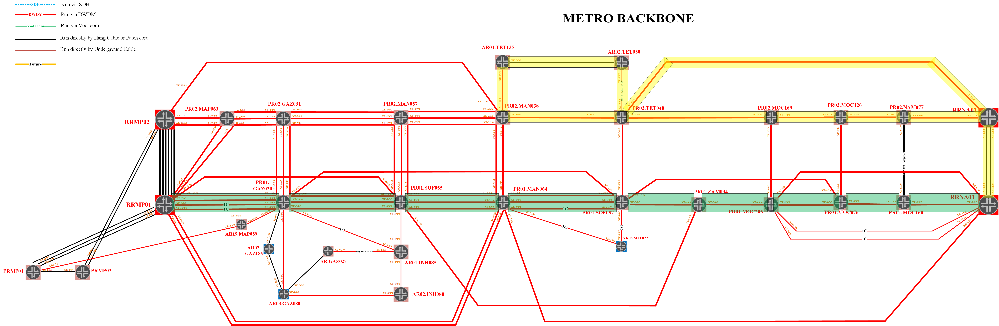

# [Movitel] Audit - Apply micro-bfd cho các kết nối Core

---

**Bổ sung micro-BFD cho các kết nối AE vùng Core**

---

**Cấu hình đang áp dụng trên một số kết nối**

- ME_PR01.GAZ020

```
set interfaces ae1 aggregated-ether-options bfd-liveness-detection minimum-interval 100
set interfaces ae1 aggregated-ether-options bfd-liveness-detection multiplier 3
set interfaces ae1 aggregated-ether-options bfd-liveness-detection neighbor 10.250.64.1
set interfaces ae1 aggregated-ether-options bfd-liveness-detection local-address 10.250.64.5
set interfaces ae3 aggregated-ether-options bfd-liveness-detection minimum-interval 100
set interfaces ae3 aggregated-ether-options bfd-liveness-detection multiplier 3
set interfaces ae3 aggregated-ether-options bfd-liveness-detection neighbor 10.250.92.37
set interfaces ae3 aggregated-ether-options bfd-liveness-detection local-address 10.250.64.5

set firewall filter PROTECT-RE term BFD from protocol udp
set firewall filter PROTECT-RE term BFD from destination-port 3784
set firewall filter PROTECT-RE term BFD from destination-port 4784
set firewall filter PROTECT-RE term BFD from destination-port 6784
set firewall filter PROTECT-RE term BFD then count BFD
set firewall filter PROTECT-RE term BFD then accept
```

```
ae1             up    up   Connect to ME_RRMP01_AE8
ae3             up    up   TO_PR.SOF055_AE0
```

```
icinga@ME_PR01.GAZ020_RE0> show bfd session
                                                  Detect   Transmit
Address                  State     Interface      Time     Interval  Multiplier
10.250.64.1              Up        xe-2/0/0       0.300     0.100        3   
10.250.64.1              Up        xe-4/3/0       0.300     0.100        3   
10.250.64.1              Up        xe-0/0/0       0.300     0.100        3   
10.250.64.1              Up        xe-2/3/0       0.300     0.100        3   
10.250.92.37             Up        xe-0/1/0       0.300     0.100        3   
10.250.92.37             Up        xe-3/0/0       0.300     0.100        3   
10.250.92.37             Up        xe-4/0/0       0.300     0.100        3   
```

```
{master}
icinga@ME_PR01.SOF055_RE0> show configuration | display set | match bfd
set interfaces ae0 aggregated-ether-options bfd-liveness-detection minimum-interval 100
set interfaces ae0 aggregated-ether-options bfd-liveness-detection multiplier 3
set interfaces ae0 aggregated-ether-options bfd-liveness-detection neighbor 10.250.64.5
set interfaces ae0 aggregated-ether-options bfd-liveness-detection local-address 10.250.92.37
set interfaces ae1 aggregated-ether-options bfd-liveness-detection minimum-interval 100
set interfaces ae1 aggregated-ether-options bfd-liveness-detection multiplier 3
set interfaces ae1 aggregated-ether-options bfd-liveness-detection neighbor 10.250.92.4
set interfaces ae1 aggregated-ether-options bfd-liveness-detection local-address 10.250.92.37

set firewall filter PROTECT-RE term BFD from protocol udp
set firewall filter PROTECT-RE term BFD from destination-port 3784
set firewall filter PROTECT-RE term BFD from destination-port 4784
set firewall filter PROTECT-RE term BFD from destination-port 6784
set firewall filter PROTECT-RE term BFD then count BFD
set firewall filter PROTECT-RE term BFD then accept
```

```
ae0             up    up   AR.GAZ020
ae1             up    up   Connect to PR01.MAN064_AE1
```

---

**Thực hiện áp dụng lên các kết nối Core - 25/01/2022**

---

**Lấy baseline trước khi thực hiện**

- Trạng thái ae 

- Trạng thái các childlink

- protocol,

- bandwidth

- trạng thái bfd của các ch ldlink

```
show bfd session
show bfd session extensive
show bfd session detail
show ppm adjacencies protocol bfd detail
request pfe execute command "show ppm adjacencies protocol bfd" target fpc7
show chassis fabric fpcs

```

**Thực hiện áp dụng micro BFD**

- Tr



**Rà soát sau khi thực hiện**

- Trạng thái ae
- Trạng thái các childlink
- protocol,
- bandwidth
- trạng thái bfd của các childlink

---

**Phát sinh: alarm CB1 trên ME_AR03.MAP018**

---

**Ghi nhận ban đầu**

- Trên ME_AR03.MAP018 phát sinh các cảnh báo lỗi:

[edit protocols]

user@R0# **set bfd traceoptions file bfd**

user@R0# **set bfd traceoptions file size 100m**

user@R0# **set bfd traceoptions file files 10**

user@R0# **set bfd traceoptions flag all**

user@R0> **file show /var/log/bfd**

start shell pfe network fpcx

 

#show ddos policer bfd stats

#show ppm statistics detail

#show ppm adjacencies

#show ppm statistics protocol bfd

#show ppm transmits protocol bfd

#show ppm adjacencies

#show ppm statistics detail
