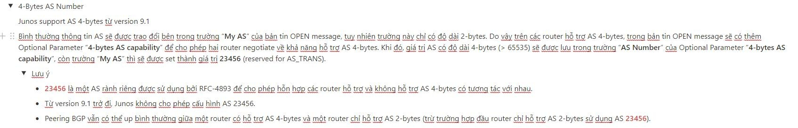
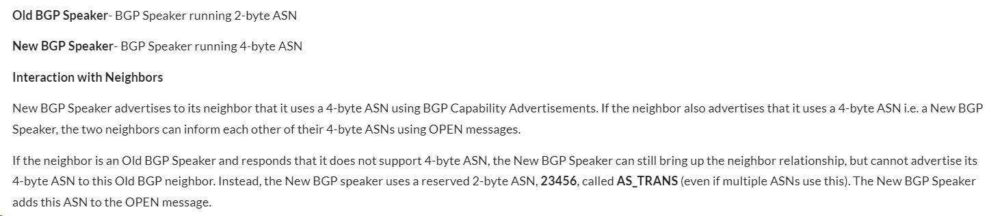
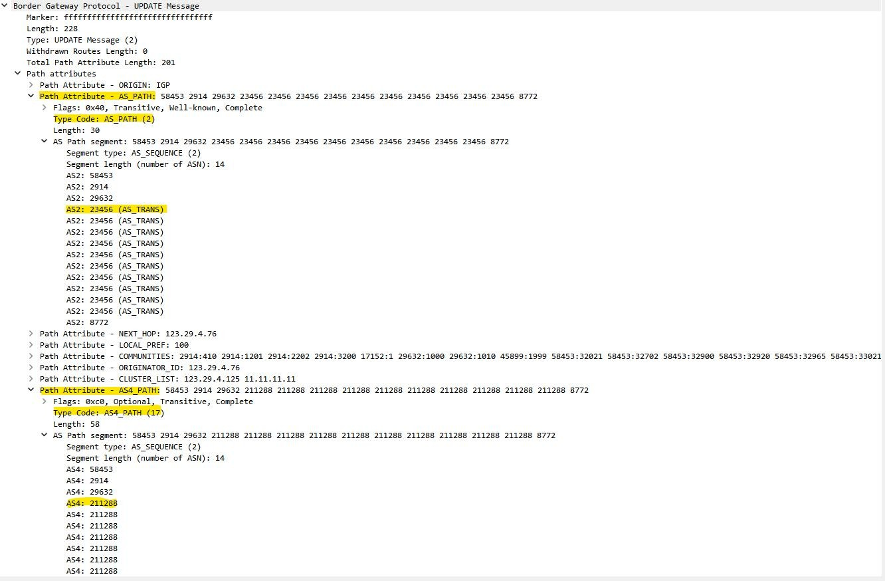

# BGP AS 4-bytes

****

****

**Khi build gói update cho neighbor không support AS4, BGP tự động send cả 2 loại attribute AS Path (bao gồm cả thông tin AS2 và AS4) nên gói tin mới bị too big (>4096 bytes)**

****
