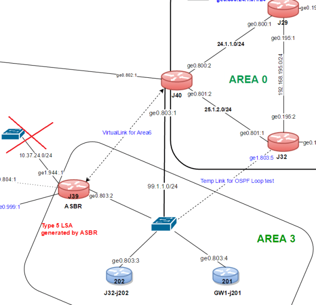
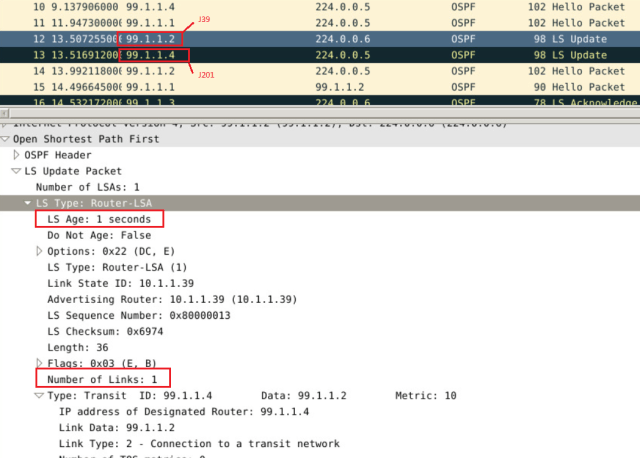
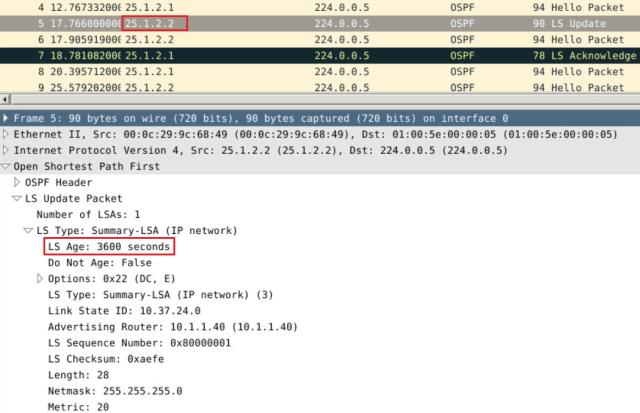

# OSPF route withdraw

<https://rtodto.net/ospf-route-withdraw-maxage-aging/>

OSPF has slightly different way of removing routes compared to BGP. On this short post, I will present how a link failure is propagated to other routers on OSPF domain. For this test, I have the following topology section in which AREA3 is connected to AREA0 and we simulate a link failure on the Junos router **J39** which has the subnet 10.37.24.0/24

**Before the failure**, we can see that 10.37.24.0/24 is contained in router LSA.

root@j39> show ospf database router lsa-id 10.1.1.39 detail area 3

OSPF database, Area 0.0.0.3

Type      ID              Adv Rtr          Seq      Age  Opt  Cksum  Len

Router  \*10.1.1.39        10.1.1.39        0x80000012    84  0x22 0xa7d5  48

bits 0x3, link count 2

id 99.1.1.4, data 99.1.1.2, Type Transit (2)

Topology count: 0, Default metric: 10

id 10.37.24.0, data 255.255.255.0, Type Stub (3) <---

Topology count: 0, Default metric: 10

Topology default (ID 0)

Type: Transit, Node ID: 99.1.1.4

Metric: 10, Bidirectional

This very same route is sent as an LSA Type 3 (summary) onto the Area0 as it can be seen below too.

root@J32> show ospf database area 0 | match 10.37

Summary 10.37.24.0 10.1.1.40 0x80000001 212 0x22 0xaefe 28 <---Advertised by J40 So far it looks good. Now we are disconnect the ethernet link on J39 connecting this network and take a packet capture on the vlan 803 to which all OSPF routers on Area3 connected. Here how it looks like;

Let me explain this screenshot. As soon as the link fails, J39(99.1.1.2) sends a new LSA Update with a neq sequence number. From what I can see is that it doesn't mention any link failure whatsoever. It is just a new Router LSA which contains only 1 link. As this is a multi access network update is sent to all DRs/BDRs addres 224.0.0.6 and then DR picks up this update and re-floods to all OSPF routers (224.0.0.5) now the question is how does Area0 is notified about this change? Let's zoom into the packet capture taken on Area0 this time.

On Area0, ABR is J40(25.1.2.2) and once it receives this new LSA, apparently it detects the difference and sends out an LSA update with LSA Type 3 (Summary) towards the other OSPF routers in Area0 but with an LSA Age of 3600secs which is actually the MaxAge for an LSA.

If you check the Area0 OSPF database, you will see that LSA age is set to 3600

root@J32> show ospf database area 0 | match 10.37

Summary  10.37.24.0      10.1.1.40        0x80000001  3600  0x22 0xaefe  28 <--LSA Age is 3600

root@J32> show ospf database area 0 | match 10.37

and after a few seconds, this LSA disappears on the backbone router along with the route itself.

Did you find this post useful or want to share anything related to this topic, please drop your comment.
