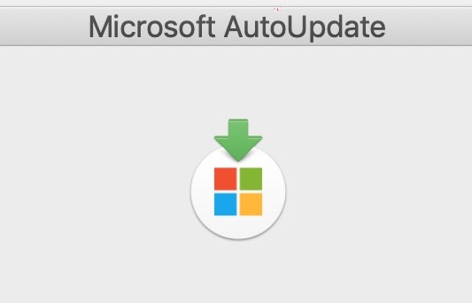
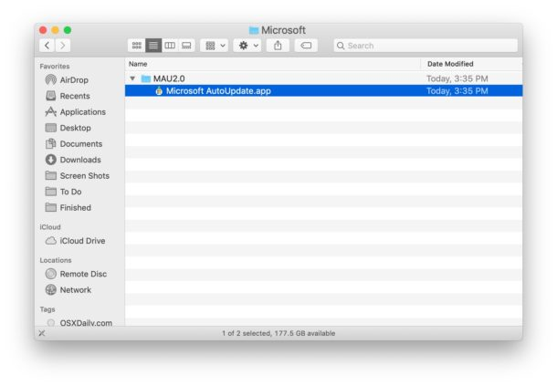

# How to Delete Microsoft AutoUpdate from Mac

**Jul 20, 2019 -¬**†[59 Comments](https://osxdaily.com/2019/07/20/how-delete-microsoft-autoupdate-mac/#comments)

Want to delete Microsoft AutoUpdate from a Mac? Perhaps you uninstalled Microsoft Office or some other Microsoft applications from the Mac and thus have no further need for Microsoft applications to automatically update themselves. In any case, you can remove the Microsoft AutoUpdate application from Mac OS.

If Microsoft AutoUpdate is currently running you’ll need to quit out of the application first. You can also forcibly quit the Microsoft AutoUpdate app from Activity Monitor if needed.

## **How to Remove Microsoft AutoUpdate from MacOS**

This will delete the Microsoft AutoUpdate app from the Mac:

1. From the Finder of MacOS, pull down the “Go” menu and choose “[Go To Folder](https://osxdaily.com/2011/08/31/go-to-folder-useful-mac-os-x-keyboard-shortcut/)” (or hit Command+Shift+G) and enter the following path:
2. /Library/Application Support/Microsoft/
3. Locate the folder named something like “MAU” or “MAU2.0” and open that directory
4. Locate and drag “Microsoft AutoUpdate.app” to the Trash
5. 
6. Empty the Trash as usual *
7. Close the MAU folder and continue using your Mac as usual

With Microsoft AutoUpdate deleted, Microsoft AutoUpdate will no longer be on the Mac or run to update software automatically.

### **Stopping com.microsoft.autoupdate.helper in Mac OS**

You can also delete “com.microsoft.autoupdate.helper” if you find that running in the background on a Mac:

1. From the Finder, select the “Go” menu and “Go To Folder” entering the following path:
2. /Library/LaunchAgents
3. Locate “com.microsoft.update.agent.plist” and add it to the Trash
4. Next go to:
5. /Library/LaunchDaemons/
6. Drag “com.microsoft.autoupdate.helper.plist” to the Trash
7. And now go to:
8. /Library/PrivilegedHelperTools
9. Drag “com.microsoft.autoupdate.helper.plist” to the Trash
10. Empty the Trash

If you still want to have and use Microsoft apps on the Mac, deleting the Microsoft AutoUpdate application may lead to some unintended consequences besides having outdated software from Microsoft, so it’s probably best to not remove it if you’re a heavy Microsoft software user, whether that’s Microsoft Office, Word, Outlook, PowerPoint, Excel, [Edge](https://osxdaily.com/2019/05/08/download-microsoft-edge-beta-mac-now/), or anything else.

* You can also [delete the file specifically from Trash](https://osxdaily.com/2019/07/18/how-delete-specific-file-trash-mac/) if you want to leave other items in the Trash alone for now.

Thanks to Bogdan in the comments for the additional info!

If you know of any other ways to manage, tame, or remove the Microsoft AutoUpdate application on the Mac, share in the comments below!
