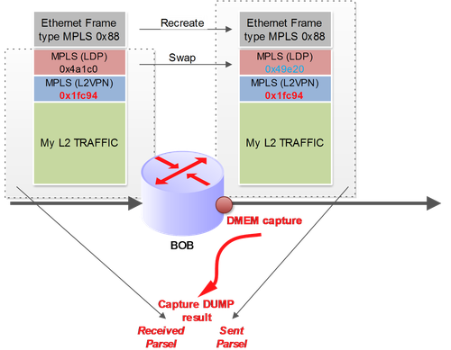

# TRIO Card: packet capture with pfe commands

<http://junosandme.over-blog.com/article-trio-card-packet-capture-pfe-commands-115251441.html>

## [TRIO Card: packet capture with pfe commands](http://junosandme.over-blog.com/article-trio-card-packet-capture-pfe-commands-115251441.html "TRIO Card: packet capture with pfe commands")

During a complex case on Juniper platform, I looked for a tip to capture transit traffic on a MX960 with Trio cards. Indeed, I suspected a Junos box to rewrite transit mpls traffic with an unexpected exp value. As I love carry out reverse engineering, I spent time in lab to find a way to display transit traffic without impacting it.

Trio based cards offer a lot of interesting shell commands. I found a set of commands that allow you to capture and display (in hexa mode) transit traffic *(with some restrictions)*

**I recommend some precautions with these commands. Before using in real network (what I did) carry out some tests in lab with the same HW and software release of your operational box. Note: I did tests on real MPC card with real traffic without any impact.**

Packet capture is done at PFE level and provided dump of packets in transmit direction. But you have 2 copies of a packet, the first one is the packet received from the fabric (ingress packet without any egress manipulation).

The second one is the packet just before it being transmitted (after adding L2 header,  MPLS/DOT1q swap, push, pop operation, CoS rewriting and so one).

Since the 11.4R5 release the packet capture commands allow to filter traffic before capturing it (really useful).

Packet capture is done at DMEM level (Data Memory). I recommend to read the awesome book: “Juniper MX Series” of Douglas Ricjard Hanks & Harry Reynolds” which includes a part explaining Memory composition of TRIO based card.

During the following test explained below, I refer to this diagram that was my use case.

***Steps to capture traffic:***

**1/ Attach to the right MPC**

---

start shell pfe network fpcX

---

**2/ Then enable packet capture of a given PFE:**

---

test jnh  packet-via-dmem enable

---

is optional. I never tuned it and always used the default configuration.

**3/ Next, launch the capture with the "match" hexa string**

**!!! Even if you can provide until 8 bytes in hexa mode as a "match" string, Do not exceed 4 bytes to avoid lmem errorz like that :** **!!!**

Jan 11 15:16:11  ncdib101 fpc4 LUCHIP(1) PPE\_7 Errors lmem addr error

In my previous example I would like to filter a specific L2VPN traffic. So I filtered on the L2VPN value ()

---

test jnh 1 packet-via-dmem capture **0x3** 1fc949

---

0x3 means capture m2l pkt and pkt\_head

1fc949 is actually the filtered string – for me this is the Label 2 of my MPLS traffic – (1fc949 = 0x1fc94 = my L2VPN label + 0x9 = EXP 4 & Stack bit =1 )

**4/ Finally you can call the “dump” command to display the captured packet(s) :**

---

NPC8(ncidf201 vty)# test jnh 1 packet-via-dmem dump

**Received** 130 byte parcel:

Dispatch cookie: 0x0082000000000000

0x00 0x06 0x0a 0x88 0xe0 0x08 0x00 0x00

0x00 0x1a 0x30 0x16 0x40 0x00 0x5e 0x69

0x4c 0x1a 0x08 0xff 0x1f 0xc9 0x49 0xff20 bits+ exp bits + S bits

0x00 0x20 0xd2 0x3e 0xa1 0x99 0x06 0x00

0x01 0x00 0x00 0x00 0x08 0x00 0x45 0x00

0x00 0x54 0x70 0xfa 0x00 0x00 0x40 0x01

0x65 0x32 0xc1 0xf9 0x10 0x01 0xc1 0xf9

0x10 0x89 0x08 0x00 0x69 0x00 0xc1 0x9f

0x07 0xd2 0x50 0xc9 0x36 0xc0 0x00 0x0a

0x52 0xf7 0x08 0x09 0x0a 0x0b 0x0c 0x0d

0x0e 0x0f 0x10 0x11 0x12 0x13 0x14 0x15

0x16 0x17 0x18 0x19 0x1a 0x1b 0x1c 0x1d

0x1e 0x1f 0x20 0x21 0x22 0x23 0x24 0x25

0x26 0x27 0x28 0x29 0x2a 0x2b 0x2c 0x2d

0x2e 0x2f 0x30 0x31 0x32 0x33 0x34 0x35

0x36 0x37

**Sent** 133 byte parcel:

0x08 0xbf 0xe0 0x0c 0x50 0x00 0x00 0x02

0xb0 0x0e 0x80 0x06 0x72 0x02 0x23 0x9c

0x5c 0x31 0xc1 0x02 0x23 0x9c 0x5a 0xb9

0xc1 0x88 0x47 0x49 0xe2 0x08 0xfe 0x1f

0xc9 0x49 0xff 0x00 0x20 0xd2 0x3e 0xa1

0x99 0x06 0x00 0x01 0x00 0x00 0x00 0x08

0x00 0x45 0x00 0x00 0x54 0x70 0xfa 0x00

0x00 0x40 0x01 0x65 0x32 0xc1 0xf9 0x10

0x01 0xc1 0xf9 0x10 0x89 0x08 0x00 0x69

0x00 0xc1 0x9f 0x07 0xd2 0x50 0xc9 0x36

0xc0 0x00 0x0a 0x52 0xf7 0x08 0x09 0x0a

0x0b 0x0c 0x0d 0x0e 0x0f 0x10 0x11 0x12

0x13 0x14 0x15 0x16 0x17 0x18 0x19 0x1a

0x1b 0x1c 0x1d 0x1e 0x1f 0x20 0x21 0x22

0x23 0x24 0x25 0x26 0x27 0x28 0x29 0x2a

0x2b 0x2c 0x2d 0x2e 0x2f 0x30 0x31 0x32

0x33 0x34 0x35 0x36 0x37

---

Received parcel is the packet received from the fabric without the L2 header. So you have to remove some bytes which are Parsel header (I don’t know the meaning

).  After many tests I've deduced that you have to remove the first 16 bytes for MPLS traffic and 20 bytes for IP traffic. After that you have your packet. In my previous capture that is MPLS traffic:

---

0x00 0x06 0x0a 0x88 0xe0 0x08 0x00 0x00

0x00 0x1a 0x30 0x16 0x40 0x00 0x5e 0x69

0x4c 0x1a 0x08 0xff 0x1f 0xc9 0x49 0xff

0x00 0x20 0xd2 0x3e 0xa1 0x99 0x06 0x00

[…]

---

After the 16 first bytes I begin to find my packet which is a copy without the Ethernet header of the packet entering in the router. You have the first label 0x4c1a0 ; the EXP = 4, S bit = 0, TTL = 255  then the second label 0x1fc94 (the filtered value ) EXP = 4, S bit 1 and TTL = 255 and so on ….

Sent parcel is the packet just before it being transmitted. It includes the L2 header. After many tests I saw that the first 13 bytes has no meaning for me (again the parsel header). After this first 13 bytes I find my L2 frame just before its transmission.

---

**0x08 0xbf 0xe0 0x0c 0x50 0x00 0x00 0x02**

**0xb0 0x0e 0x80 0x06 0x72** 0x02 0x23 0x9c

0x5c 0x31 0xc1 0x02 0x23 0x9c 0x5a 0xb9

0xc1 0x88 0x47 0x49 0xe2 0x08 0xfe 0x1f

0xc9 0x49 0xff 0x00 0x20 0xd2 0x3e 0xa1

[...]

---

Here I have :

0x02 0x23 0x9c 0x5c 0x31 0xc1 = Dst MAC address

0x02 0x23 0x9c 0x5a 0xb9 0xc1 = Src MAC address

0x88 0x47 = EtherType MPLS

0x49e20 = First label after the swap action 0x49e20

0x4 = the EXP = 4 & S bit = 0

0xff = MPLS TTL (255)

0x1fc94 = the the second  label (the filtered value)

0x9= the EXP = 4 & S bit =1

0xff = MPLS TTL (255)

etc.

**!!!** **AND don’t forget to stop packet capture :** **!!!**

---

test jnh  packet-via-dmem disable

---

David.
