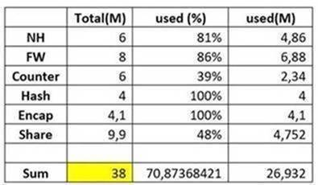

# 2021-0628-0028: heap memory increase

Hi Anh,

Please find my answers below.

Query 1

-> Could you more explain, offload traffic? I don’t understand your term in the case. If can, tell me some ways how to do this.

JTAC: Move few interfaces out of MPC4E to another line card (MPC6E / MPC9E) where memory is available would be the first step (to reduce NH). There are many ways and we recommend reaching out to accounts team for such design related queries on how to manager your device better to reduce the load on few FPCs.

Query 2

I have a bit confuse here. As I calculate about memory table, when I show the command "show jnh 0 pool usage" the total value is 38M while MPC4E is 32M

JTAC: I cannot share specifics of how memory is used on a MPC4E card. But I can clearly see your calculation is incorrect.

Existing memory structure which the software uses on MPC4E card is below.

EDMEM overall usage:

[NH////////////|FW/////////////////|CNTR///////////|HASH//////|ENCAPS////|---------]

0              6.0                 14.0            20.0       24.0       28.1      32.0M

Shared Memory - NH/FW/CNTR/HASH/ENCAPS

[\*\*\*\*\*\*\*\*\*\*\*\*\*\*\*\*\*\*\*\*\*\*\*\*\*\*\*\*\*\*\*\*\*\*\*\*\*\*|------------------------------------------] 9.9M (48% | 52%)

You cannot include the \*shared memory\* to the existing memory structure and add that as a part of your memory calculation. There are few areas of each components memory shared, in case one gets overwhelmed.

Hope this clarifies.

---

Dear Vishwannath,

Morning!

After reading your email, I understanding that heap memory in some FPCs is due to \*scaling\*.

I have 2 queries for you.

+ “We recommend to offload traffic (to decrease NH) from the MPC4E to reduce the heap utilization.”

-> Could you more explain, offload traffic? I don’t understand your term in the case. If can, tell me some ways how to do this.

+More query:

I have a bit confuse here. As I caculator about memory table, when I show the command "show jnh 0 pool usage" the total value is 38M while MPC4E is 32M

EDMEM overall usage:

[NH////////////|FW/////////////////|CNTR///////////|HASH//////|ENCAPS////|---------]

0              6.0                 14.0            20.0       24.0       28.1      32.0M

Next Hop

[\*\*\*\*\*\*\*\*\*\*\*\*\*\*\*\*\*\*\*\*\*\*\*\*\*\*\*\*\*\*\*\*\*\*\*\*\*\*\*\*\*\*\*\*\*\*\*\*|-----------] 6.0M (81% | 19%)

Firewall

[\*\*\*\*\*\*\*\*\*\*\*\*\*\*\*\*\*\*\*\*\*\*\*\*\*\*\*\*\*\*\*\*\*\*\*\*\*\*\*\*\*\*\*\*\*\*\*\*\*\*\*\*\*\*\*\*\*\*\*\*\*\*\*\*\*\*\*\*\*|----------] 8.0M (86% | 14%)

Counters

[\*\*\*\*\*\*\*\*\*\*\*\*\*\*\*\*\*\*\*\*\*\*\*|------------------|RRRRRRRRRRRRRRRRRR] 6.0M (39% | 61%)

HASH

[\*\*\*\*\*\*\*\*\*\*\*\*\*\*\*\*\*\*\*\*\*\*\*\*\*\*\*\*\*\*\*\*\*\*\*\*\*\*\*\*] 4.0M (100% | 0%)

ENCAPS

[\*\*\*\*\*\*\*\*\*\*\*\*\*\*\*\*\*\*\*\*\*\*\*\*\*\*\*\*\*\*\*\*\*\*\*\*\*\*\*\*] 4.1M (100% | 0%)

Shared Memory - NH/FW/CNTR/HASH/ENCAPS

[\*\*\*\*\*\*\*\*\*\*\*\*\*\*\*\*\*\*\*\*\*\*\*\*\*\*\*\*\*\*\*\*\*\*\*\*\*\*|------------------------------------------] 9.9M (48% | 52%)

Free Shared Memory - NH/FW/CNTR/HASH/ENCAPS

[\*\*\*\*\*\*\*\*\*\*\*\*\*\*\*\*\*\*\*\*\*\*\*\*\*\*\*\*\*\*\*\*\*\*\*\*\*\*\*\*\*\*\*\*\*\*\*\*|--------------------------------] 9.9M (60% | 40%)

Also, I would like to know the exact calculator form for the memory of MPC4E.

Thanks for your help.
