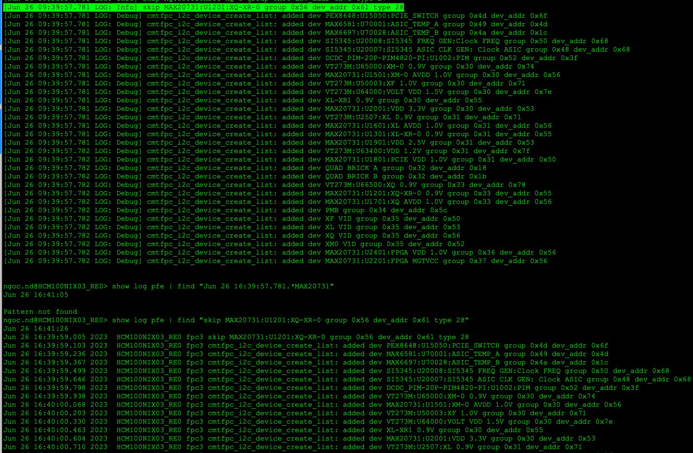
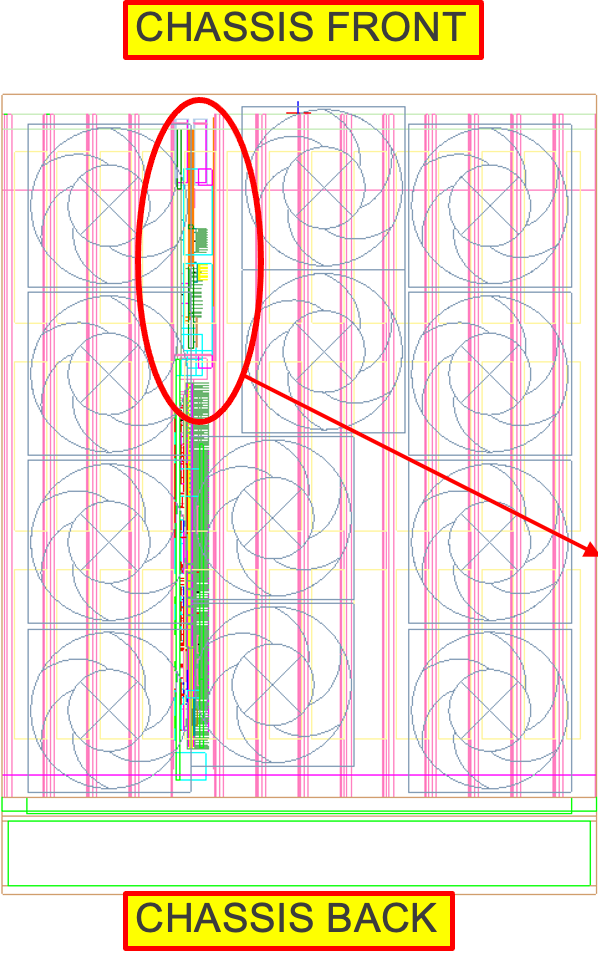
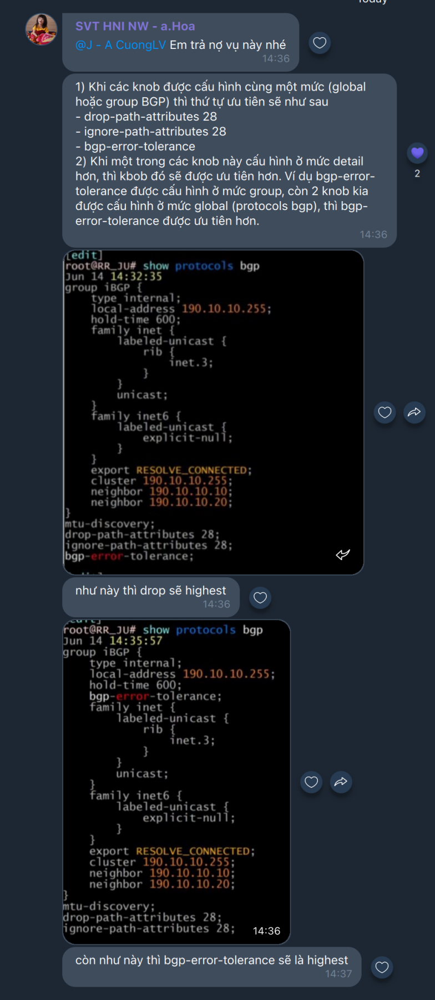

# BGP errror messages

Multiprotocol Reachable NLRI

The third bit is the partial bit, it defines whether the information in the optional transitive attribute is partial (value= 1) or complete (value = 0). Well-known and optional non-transitive are always set to complete. The partial bit is set to 1 in the following cases:

- Unrecognized optional transitive attribute that is passed to peers, the sender sets the partial bit.

- Optional transitive attribute attached by some router other than the originator or the route. 

  (MP_REACH_NLRI) and Multiprotocol Unreachable NLRI (MP_UNREACH_NLRI).

   The first one (MP_REACH_NLRI) is used to carry the set of reachable

   destinations together with the next hop information to be used for

   forwarding to these destinations.  The second one (MP_UNREACH_NLRI)

   is used to carry the set of unreachable destinations.

[https://www.juniper.net/documentation/us/en/software/junos/bgp/topics/topic-map/bgp-error-messages.html](https://www.juniper.net/documentation/us/en/software/junos/bgp/topics/topic-map/bgp-error-messages.html)

---

[https://www.ietf.org/archive/id/draft-ietf-idr-entropy-label-03.txt](https://www.ietf.org/archive/id/draft-ietf-idr-entropy-label-03.txt) <<< draft mới, thưc hiện từ junos 23 trở đi

---

RFC6790 <<< Entropy

RFC7447 <<< cancel attribute 28

---

The issue is that Junos may recognize optional, transitive attributes that are not yet recognized by other vendors' routers. *In this case, non-Junos routers which don't recognize the attribute just pass the UPDATE through with the Partial bit ON.*

---

3.4. ELCv3 Error Handling

The ELCv3 is considered malformed and must be disregarded if its length is other than zero.

---

Error checking of an UPDATE message begins by examining the path

   attributes.  If the Withdrawn Routes Length or Total Attribute Length

   is too large (i.e., if Withdrawn Routes Length + Total Attribute

   Length + 23 exceeds the message Length), then the Error Subcode MUST be set to Malformed Attribute List.

---

---

set protocols bgp drop-path-attributes [ 11-13 19 21 24-25 27 30-31 33-255 ]

---

The presence of multiple MP_{UN}REACH attributes in one BGP update is also considered to be a fatal error.

---

[https://supportportal.juniper.net/s/article/BGP-UPDATE-with-malformed-Path-Attribute-tears-down-BGP-session?language=en_US](https://supportportal.juniper.net/s/article/BGP-UPDATE-with-malformed-Path-Attribute-tears-down-BGP-session?language=en_US)

---

[https://supportportal.juniper.net/s/article/Mitigation-techniques-for-BGP-updates-containing-malformed-attributes?language=en_US](https://supportportal.juniper.net/s/article/Mitigation-techniques-for-BGP-updates-containing-malformed-attributes?language=en_US)

---

This specification also defines an RCA capability that can be used to advertise the ability to process the MPLS Entropy Label as an egress LSR for all NLRI advertised in the BGP UPDATE. It updates RFC 6790 and RFC 7447 concerning this BGP signaling.

---

BGP has optional-transitive path-attributes, which are both strength and weakness for the protocol. They are strength because this is what provides the extensibility to the protocol, that enable deploying new applications/services in an incremental fashion. Unrecognized optional-transitive attributes are propagated further, so that the attributes can be tunneled across cloud-of-speakers that don’t understand the new-feature to a speaker that understands it. 

This tunneling property also turns out to be the weakness in cases when malformed-attributes are originated. Because it causes session bounces far away from the attribute origination.  

Why bounce session on bad attribute/update?  

This has kept the Internet free of mal-speakers/implementations because any implementation connected to the Internet which originates a mal-update immediately catches wide attention. This is a good thing over-all in preserving sanity of speakers on the Internet as a bad-speaker is immediately taken off the Internet, though it causes immediate/short-term disruptions in service.  

This behavior is especially good if the mal-attribute is originated by the immediate neighbor. As this keeps the mal-attribute contained within the first-BGP-hop of origination-point. And operators can take corrective action to correct the mal-implementation.

---

Why bounce session on bad attribute/update?  

This has kept the Internet free of mal-speakers/implementations because any implementation connected to the Internet which originates a mal-update immediately catches wide attention. This is a good thing over-all in preserving sanity of speakers on the Internet as a bad-speaker is immediately taken off the Internet, though it causes immediate/short-term disruptions in service.  

This behavior is especially good if the mal-attribute is originated by the immediate neighbor. As this keeps the mal-attribute contained within the first-BGP-hop of origination-point. And operators can take corrective action to correct the mal-implementation.

---

