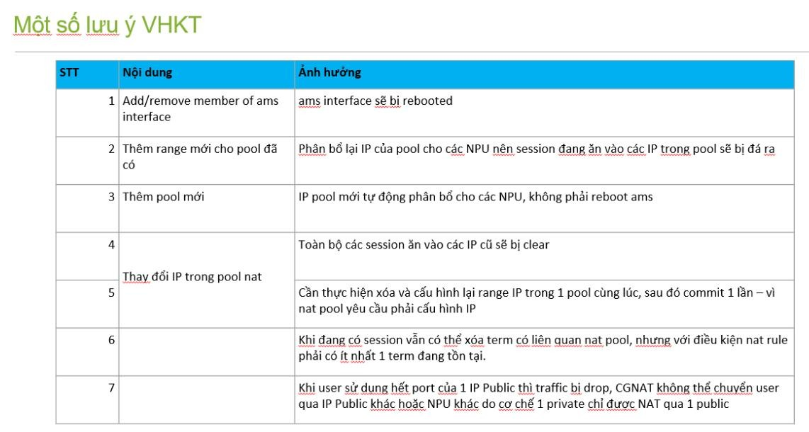

# CGNAT  thêm range mới vào trong Pool đã khai báo

Này là hit với việc thêm range mới vào trong Pool đã khai báo (IP public)

Như anh Hưng nói thì mình thao tác tách ra:

* Trước khi thêm range, cần remove thuê bao (sessions đang được NAT(sad)

  - Deactivate service-set

  - Disable interface ams.xx inside

* Add thêm range

* Khi active lại thì chú ý:

  - Activate service-set —> commit

  - Enable interface ams.xx inside —> commit

**=> Summary lại: việc activec lại thì tách thành 2 lần commit**

---

nhưng có 1 thông tin match là: (đúng là lỗi của Mr.Quân) thiệt:

Không nên action activate service-set + enable int ams inside cùng một lúc --> nhiều khả năng gây ra lỗi nhe

Description: AMS interface is updated in patricia db in case of warm standby.

Debugging the issue indicates that ams interface is not added/updated in spinfo DB as IF_RDD flag is not ON.

In older releases (19.3), this flag is ON even in warm standby case.

Problem Reports:

RBU_SERVICES_REGRESSIONS:[cgnat] [cgnatstag] Service-set nat pool is not shown on expected ams interface

---

---

I will look for it and share it with you

the addition of new pool in services will only get programmed once the service-set is restarted

if it is impacting with the deactivate/activate of service-set you can perform the activity in MW and that will resolve your problem
