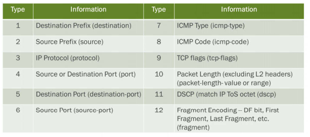
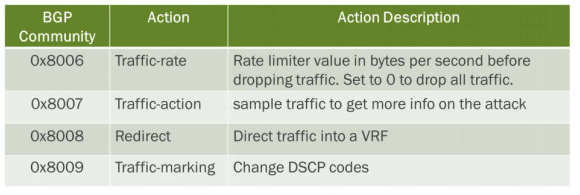

# Chapter 14: BGP FlowSpec

**DDoS Attack Mitigation**

- Attack Mitigation

- • Unicast Reverse Path Forwarding (Anti-Spoofing)
- • Destination-based Remote Triggered Black Hole
- • Source-based Remote Triggered Black Hole

- A Better Solution

- •BGP FlowSpec

**Unicast Reverse Path Forwarding**

- Internet Standard - Anti Spoofing

- • BCP 38 (Best Common Practice)
- • RFC 2827
- • RFC 3704

- Verifies that the source IP of the incoming packet has a resolvable route in the routing table
- Multiple operational modes

- • Strict mode

- • The interface that the packet is received on must be the best and active path back to the source prefix.

- • Loose mode

- • Source address must match a prefix in the routing table (accommodates asymmetric routing)

**Destination-based RTBH**

- Destination-based remote triggered black holes

- • Attacked device’s IP address is advertised via BGP to ISP
- • Advertisement includes black hole community string
- • IBGP import policy on edge PEs drop traffic heading to the destination IP.

**Source-based RTBH**

- Source-based remote triggered black holes

- • Attacker source IP address is advertised via BGP to ISP
- • Advertisement includes black hole community string
- • Use with unicast RPF to cause routers to drop traffic at edge

**RTBH Issues**

- Problems with RTBH

- • Destination based RTBH knocks victim offline
- • Source address of attacker often not known or too numerous to block
- • Source addresses hidden by carrier-grade NAT (blocking legitimate users)
- • Source addresses may be public DNS, NTP, SNMP, or LDAP servers that provide needed services.

- Using just a source or destination address is not granular enough to effectively block just the attack traffic.

**BGP FlowSpec**

- BGP FlowSpec

- • Provides a method to remediate DoS or DDoS attacks
- • Defined in industry standard RFC 5575
- • Uses BGP NLRI to advertise a route and protocol details
- • Automatically configures firewall filter or policer
- • Uses BGP AFIs 1 and 2 and SAFIs of 133 and 134

**BGP FlowSpec Operation**

- BGP Flowspec

- • DDoS attack is initiated
- • Send flow information via BGP updates
- • In Junos these flow updates are populated in inetflow. 0
- • Built-in firewall filters drop traffic that match the flow

**BGP FlowSpec NLRI Types**

**Traffic Filtering Actions**

Traffic Filtering options are extended communities added to a route

Define the actions to be taken on the traffic

**Traffic Filter Rule Order Processing**

- RFC uses a deterministic algorithm

- • Starts by comparing the left-most-components of each NLRI
- • If the types differ, the lowest type by numeric value is used. If they are the same, then the values within that component are compared
- • For IP prefix values (types 1,2, and 3), the lowest IP is chosen. If the IP addresses are the same, the most specific prefix is used.
- • For all other types, the binary string of the contents is compared to determine the order.

- Junos by default does not support the RFC deterministic algorithm
- Best Practice is to have Junos follow the RFC route selection

- • Requires routing-options flow term-order set to standard

**FlowSpec Validation**

- A flow specification received from a BGP peer will need to be validated against the associated routing table before being accepted
- A route is only considered valid if:

- 1. The originator of the flow specification matches the originator of the bestmatch unicast route for the destination prefix embedded in the flow specification
- 2. There are no more-specific unicast routes, when compared with the flow destination prefix, that have been received from a different neighboring AS than the best-match unicast route determined in #1.

- By default JUNOS validates using the above rules. This validation can be disabled, and custom policies can used to validate the FlowSpec routes.

**Case #1: Customer Requirements**

- To respond to this attack the customer will need:

- • An established **family inet unicast** and **flow** peering with the SP
- • Advertise their internal network prefix to the SP
- • To configure the flow specification under **routing-options**
- • To create a policy to export routes (as needed)
- • To configure BGP to export the policy

**Case #1: Provider Edge Requirements**

- To receive flow specification data from a customer the PE needs:

- • An EBGP **family inet unicast** and **flow** peering with the Customer
- • An IBGP **family inet unicast** and **flow** peering with all other PEs
- • A policy to accept **family inet flow** routes from the customer
- • A policy to send **inetflow.0** routes to PE peers
- • The flow **term-order** option set to **standard**

**Case #2 - NOC Remediation - RR Requirements**

- To implement NOC remediation, the following is needed on the RR:

- • Configure the FlowSpec details under routing-options and use the RFC standard processing order
- • Configure the RR to peer with all edge PE routers using family inet flow
- • Configure a policy to advertise inetflow.O routes to IBGP peers and reject all incoming routes

**Case Study #2 - PE Requirements**

- To implement NOC remediation, the following is needed on the PE:

- • A policy to provide custom validation of inetflow.O routes
- • BGP configured to import and validate flow routes using the policy
- • The FlowSpec **term-order** option should be set to **standard** and should be configured to limit the total number of routes allowed in the inetflow.O table

**View and Verify BGP Peerings**

- Verifing FlowSpec is configured between BGP peers

lab@mxA> show bgp summary

**View and Verify Flow Routes**

- View inetflow.O table entries

lab@router> show route table inetflow.O extensive

- The Next hop type is set to Fictitious because there is no next hop for this type of NLRI

**Hidden Flow-routes**

- Example of a Flow-route that failed FlowSpec validation

lab@router> show route table inetflow.O extensive hidden

- There are two ways for the route to pass validation. The Flow-route must be within the range of routes originated and advertised by the Customer to the Service Provider or a custom validation policy must exist on the service provider router to override the default validation process.

**View Flow Validation**

Flows must be validated before conversion to firewall filters

> show route flow validation detail

**Verify Firewall Filters**

- Firewall filter automatically created

lab@mxC-R3> show firewall

- NOTE: Current implementation applies the Firewall Filter to all interfaces

use the JUNOS traceroute command and set the port to 53. This will generate one packet of UDP port 53 traffic before switching over to random ports.
