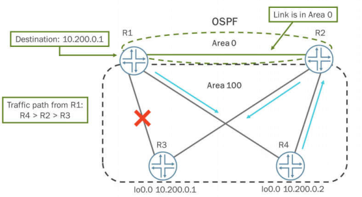
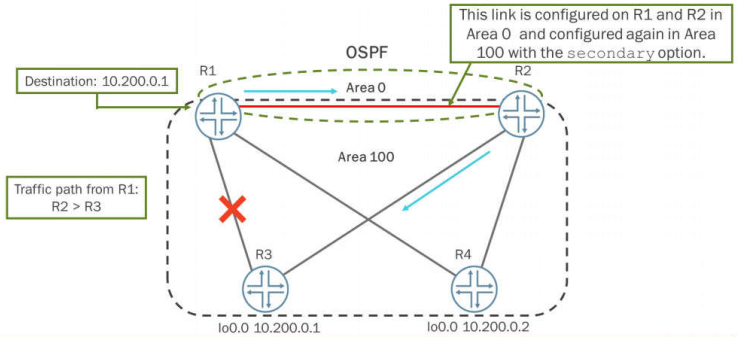
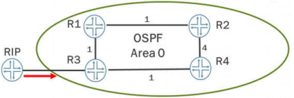
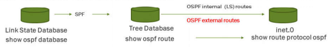
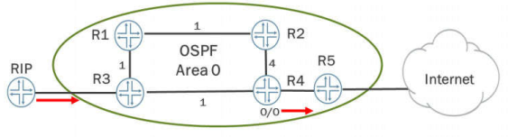

# Chapter 4: Advanced OSPF Options

---

Chapter 4: Advanced OSPF Options

---

Multi-Area Adjacency

- By default, a single interface can belong to only one OSPF area.

- In some situations, you might want to configure an interface to belong to more than one area.

- The ABRs establish multiple adjacencies belonging to different areas over the same logical interface.
- Assigning a single interface to at least two distinct areas:

- One as the primary
- And the others as secondary

- Must use the secondary option.
- Secondary link shows up as a point-to-point interface

Case Study: Multi-Area Adjacency (1 of 2)

- What happens to traffic from R1 to R3 if a link fails between R1 and R3?

- Traffic from Rlto R3 would flow from R4 to R2 and then to R3. Routing will happen this way regardless of metric values because OSPF always prefers intra-area paths over inter-area paths.

Case Study: Multi-Area Adjacency (2 of 2)

- Overcome the routing issue with a multi-area adjacency

Network Integration

- Company acquisitions and mergers - integrating multiple OSPF networks

- OSPF requires a stable contiguous backbone

- Unpredictable results
- Loops
- Missing routes

- Can require temporary solutions

- Virtual links

- Permanent solutions

- Physical connectivity

Virtual Links

- Provides a logical connection

- Used for areas not physically connected to Area 0
- Used to connect a discontiguous Area 0

- Tunnels OSPF packets through a transit area

- Creates a virtual ABR to remote routers
- Configuration on both ends of the tunnel
- Does NOT tunnel data packets

- Control plane only

- SPF will calculate the shortest path to all routes

OSPF External Reachability (1 of 2)

- OSPF default export policy

- Routes are not redistributed between protocols by default
- Default export policy rejects all routes

OSPF External Reachability (2 of 2)

- Route redistribution requires an export policy

- Applied at the OSPF global level
- Creates Type 5 External LSAs

- Type 1 or Type 2 (default)

OSPF Prefix Limits (1 of 2)

- Prefix limits are used as protection against redistributing too many external routes into OSPF

- Redistribution requires an export policy

- An incorrect OSPF export policy can inadvertently inject an excessive number of external routes
- An external peer router can suddenly start advertising more routes than expected

- One Type 5 LSA is created per external route

- Each Type 5 is flooded across the OSPF domain

OSPF Prefix Limits (2 of 2)

- the Junos OS allows you to limit the number of prefixes that can be accepted.

- The prefix-export-limit command informs the router how many routes to accept from a routing policy configuration.
- Once the route limit is reached, the router transitions into an overload state.
- Additionally, all Type 5 LSAs from the router are purged from the database and the network.

OSPF Mutual Redistribution

- Mutual redistribution

- Redistribution from multiple routers
- Redistribution from multiple protocols
- Common reason for routing loops
- Redistribution rule

- Source route has a lower preference (smaller number)

- No problem

- Source route has a higher preference (larger number)

- Sub-optimal routing
- Routing loops

External Routes

- Redistribute the default route from OSPF into RIP

- High preference of 150 to a low preference of 100
- The RIP route is the active route
- Modify the OSPF external preference to 90.

OSPF Import Policy (1 of 3)

- You need to prevent the RIP routes from appearing on R4

- An import policy can be used to accomplish this task
- Import policies only affect which external routes are copied from the tree database into the inet.0 table

OSPF Import Policy (2 of 3)

- Import policies must be used with care!

- R5 will know about the RIP routes because the import policy does not affect LSA distribution
- R5 sending traffic towards RIP router could be black holed at R4

---

OSPF - Discontiguous Nonzero Areas
