# Chapter 6: IS-IS

---

Chapter 6: IS-IS

---

Overview of IS-IS

- An interior gateway protocol based on the SPF algorithm

- Uses link-state information to make routing decisions

- Developed for routing ISO CLNP packets

- IP was added later

Integrated IS-IS

- Implementation of IS-IS for routing IP in addition to CLNS, also called dual IS-IS
- All routers run a single routing algorithm
- SRX Series and MX Series platforms support CLNP/CLNS routing

- M Series, and T Series platforms do not support native CLNP/CLNS routing

- IS-IS routers exchange LSPs

- Similar to OSPF LSAs/link-state update packets
- IS-IS PDUs are used to transmit the routing information

- Sometimes called packets to conform with IP terminology

- IP reachability information is included in the updates

IS-IS Concepts

- IS-IS network is a single autonomous system

- End systems: Network entities (hosts) that send and receive packets
- Intermediate systems: Network entities (routers) that send, receive, and forward packets
- PDUs: Protocol data units; term for IS-IS packets

- A single AS can be divided into smaller groups called areas, which are organized hierarchically

- Level 1 intermediate systems route within an area or toward a Level 2 system

- Attached bit

- Level 2 intermediate systems route between areas and toward other ASs

Network Entity Title

- The area address can range from1 to 13 bytes in length and is always the first component of the Network Entity Title (NET) address.
- The middle portion of the NET is the system ID of the router, which should be unique throughout the entire domain.

- The system ID is always 6 bytes and can be any set of hexadecimal digits you want. One common convention is placing the IP address of the loopback interface into the system ID portion of the NET.

- The NSEL byte (or N-selector) is the last byte of the NET address. It identifies the destination network layer service that should receive the traffic.

- For a router, this part of the address will always be 00.The IS-IS protocol may assign this value to represent the pseudo-node.

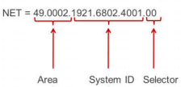

IS-IS and OSPF Comparison

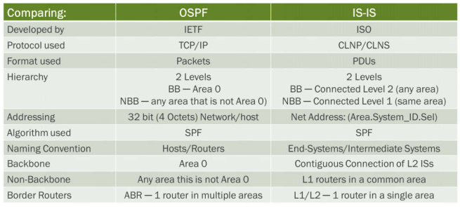

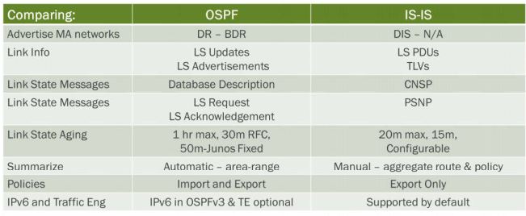

IS-IS Areas

- A single IS-IS router can be in only one area per instance
- A L2 IS-IS interface can form an adjacency with a router in the same area or in a different area
- The backbone is a contiguous set of L2 links

- The area borders are on the links, not on the routers.
- The routers that connect areas are Level 2 routers
- Routers that have no direct connectivity to another area are Level 1 routers.

- An intermediate system can be a Level 1 router, a Level 2 router, or both (an L1/L2 router)

LSP Format

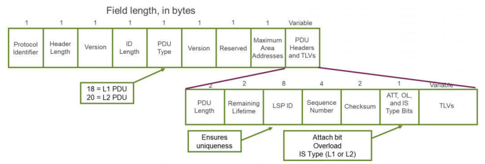

- Describes the state of adjacencies in neighboring IS-IS routers

- Some fields of interest in the LSP header include the ID length and the maximum area address, which are set to a constant value of 0x00.

- This value does not mean that Junos OS does not support their functionality, used for backward compatibility with older protocol implementations.

- The system ID is always 6 bytes in length, and the maximum area addresses supported is always 3 bytes.
- By setting these two fields to a value of 0, Junos OS is reporting that it supports the default values for these two settings.

- You might also notice that the LSP header contains two version fields.

- The first of these fields, according to the original IS-IS specification, was designed as an extension of the protocol ID field. Most modern implementations, including Junos OS, do not support this function and instead place a constant value of 0x01 in the field to represent the version of the protocol.
- The second version field is the actual specified location for the protocol version, which is also set to a value of 0x01—the current version of the protocol

- Flooded periodically throughout a level

- By default, this timer value is set to 1200 seconds, or 20 minutes.

- Each router takes this value and begins a countdown toward 0.

- Before the timer expires (at approximately 317 seconds), the originating system regenerates the LSP and floods it to all its neighbors

- Contains multiple TLV segments

LSP Notes

- PDU type field denotes a Level 1 or Level 2 PDU

- Level 1 PDU = 18
- Level 2 PDU = 20

- LSP ID field provides uniqueness in the domain

- The ID of the LSP uniquely identifies it within the IS-IS domain.
- The 8-octet field is comprised of:

- The router’s system ID (6 bytes): located within the NET address of the router
- The circuit ID (1 byte): helps distinguish LSPs advertised from a single router.

- By default, all LSPs representing the router as a node use a value of 0x00.

- Junos OS uses a circuit ID value of 0x01 for the loopback interface as well as all point-to-point interfaces.
- Each broadcast segment receives a unique circuit ID value beginning at 0x02 and incrementing to 0xff.

- The LSP number (1 byte): represents a fragmented LSP.

- The initial LSP receives a value of 0x00, and it is incremented by 1 for each following fragment

- Attached (ATT) bit is set if the IS is connected to another area (L1/L2 connect to area khác area của nó/vùng level 2 có con router khác area là được)
- Overload (OL) bit is set if the link-state database is overloaded
- IS type bits determine a Level 1 or Level 2 router (only 2 settings possible)

- Level 1 router = 01 = 0x1
- Level 1/2 router = 11 = 0x3

IS-IS Messages

- Hello (IIH)
- Link State PDUs (LSP)
- Partial Sequence Number PDUs (PSNP)
- Complete Sequence Number PDUs (CSNP)

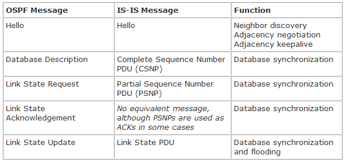

Hello PDUs

- The hello mechanism for neighbor discovery is used to build an maintain adjacencies

- Similar to the hello mechanism in OSPF

- Separate hellos for:

- Broadcast networks

- Level-1 LAN hello (PDU type 15)

- IS-IS Level 1 is coded with multicast address 01-80-C2-00-00-14

- Level-2 LAN hello (PDU type 16)

- IS-IS Level 2 hellos is coded with multicast address 01-80-C2-00-00-15

- Point-to-point hello (PDU type 17)

- Sent at regular intervals

- DIS is sent at 1/3 the Hello timer

- By default a DIS router sends hello packets every 3 seconds,
- A non-DIS router sends hello packets every 9 seconds.

- Hello PDUs:

- Identify the device
- Describe its capabilities
- Describe the parameters of the interface

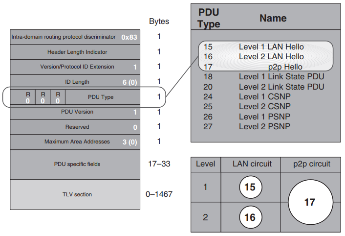

LSPs

- Used to build the link-state database

- Similar to LSAs in OSPF

- Separate LSPs for:

- Level 1 systems (PDU Type 18)
- Level 2 systems (PDU Type 20)

- Sent as a result of:

- Network change,
- During adjacency formation, and
- In response to a sequence number PDU (described on the next slide)

- LSPs:

- Identify an IS’s adjacencies
- Describe the state of its adjacencies
- Describe its reachable address prefixes (routes)

Sequence Number PDUs

- Partial sequence number PDU

- Used to:

- Maintain the link-state database synchronization
- Acknowledge LSPs from a neighbor on a point-to-point network
- Request a copy of a missing LSP on a broadcast network

- Separate PDU types for Level 1 (26) and Level 2 (27) systems
- Contains specific header information for the LSP being acknowledged or requested

- Complete sequence number PDUs

- Used to maintain the link-state database synchronization

- Sent periodically by all ISs on point-to-point networks
- Only sent by DIS on broadcast networks

- Separate PDU types for Level 1 (24) and Level 2 (25) systems
- Contains header information for all LSPs in the IS’s link-state database

Type/Length/Values

- IS-IS information objects

- Each piece of IS-IS information is defined as an object with three attributes:

- Object type: The predefined code for the type of information contained in the object
- Object length: The length of the information (allows for variable-length objects)
- Object value: The actual information defined by the type attribute

- TLVs are the building blocks of IS-IS PDUs, which are used for information exchange

- Some TLVs are used in multiple PDUs
- Some TLVs are PDU-specific

- Similar to OSPF packet-specific and LSA-specific fields
- IS-IS ignores all unknown TLVs, making the protocol easily extensible

Some TLV Examples

- TLV Variables

- TLV1 (Area address): Provides the area address encoded within the IS-IS NET on the loopback 0 (loO) interface.
- TLV 2 (IS reachability): Advertises the IS neighbors adjacent to the local router as well as the metric used to reach those neighbors.
- TLV 10 (Authentication): Contains the authentication type and the configured password.
- TLV 22 (Extended IS reachability): Advertises the IS neighbors adjacent to the local router and the routers that support traffic engineering capabilities. This TLV also contains multiple sub-TLVs that describe the user constraints placed on the router by the network administrator. This TLV also populates the traffic engineering database (TED).
- TLV 128 (IP internal reachability): Advertises the IP address and subnet mask for each of the router’s interfaces capable of supporting IP version 4 (IPv4) traffic.
- TLV 129 (Protocols supported): Informs other routers in the network which Layer 3 protocols the local router supports. By default, Junos OS supports both IPv4 and IP version 6 (IPv6). On the MX Series Services Router and the SRX Series Services Gateways, you can also use Junos OS to support CLNS.
- TLV 130 (IP external reachability): Advertises the network and subnet mask for all routes advertised into IS-IS by using a policy.
- TLV 132 (IP interface address): Advertises the host IP address for all router interfaces.
- TLV 134 (Traffic engineering IP router ID): Advertises the 32-bit router ID (RID) of the local router.
- TLV 135 (Extended IP reachability): Advertises the IP address and subnet mask for router interfaces that can support traffic engineering. This TLV also populates the TED.
- TLV 137 (Dynamic hostname resolution): Advertises the ASCII hostname configured on the local router. Other IS systems use this TLV to resolve the hostname of the router for use in show command output and within certain TLVs.

- Multiple Topology TLVs

- TLV 222 (Multiple topology IS reachability): Advertises the IS neighbors adjacent to the local router and the routers that support multiple topologies of IS-IS.
- TLV 229 (Multiple topologies supported): Advertises which multiple topologies of IS-IS the local router supports. Each topology is identified by a 12-bit ID field.
- TLV 235 (Multiple topology IP reachability): Advertises the IP information for interfaces that support multiple topologies. This TLV contains multiple sub-TLVs, which define the actual information. Each set of sub-TLVs is accompanied by the 12-bit topology ID field.

- IPv6 TLVs

- TLV 232 (IPv6 interface address): Advertises the IPv6 interface address for those interfaces that support IPv6 traffic.
- TLV 236 (IPv6 reachability): Advertises information about the network link on which the IPv6 protocol is operating. This TLV contains multiple sub-TLVs that contain the actual metric information, among other things.

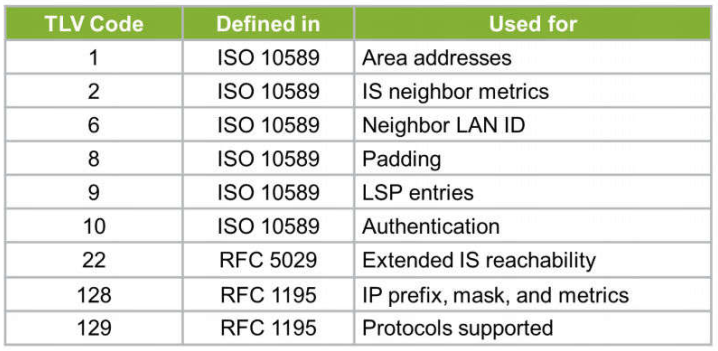

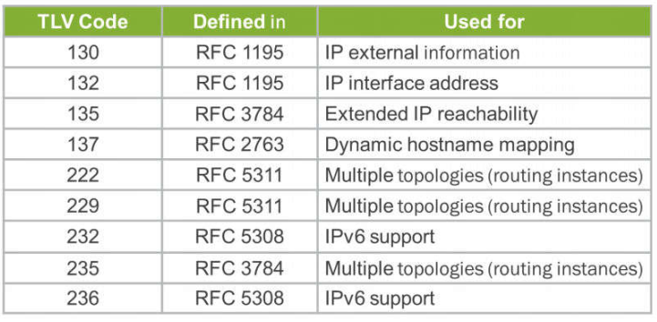

TLV 1-Area Address

- Advertises the area ID of the originating router

- (1-byte) TLV type
- (1-byte) TLV length: This field contains the length of the remaining fields in the TLV
- (1-byte) Area length

- Repeated for each configured area

- (Variable) Area ID

- Ranges from 1 to 13 bytes
- Repeated for each configured area

TLV 2-IS Reachability

- Describes the IS neighbors of the local router

- Metric cost to each neighbor is advertised
- Metric and neighbor ID fields are repeated for each neighbor

- (1-byte) TLV type
- (1-byte) TLV length: Each set of neighbors and metrics occupies 11 octets of space.

- The field length minus 1(for the virtual flag) should be divisible by 11, resulting in the number of adjacent neighbors

- (1-byte) Virtual flag: An IS-IS router sets this flag when the advertised information should be used to repair a nonadjacent Level 2 area.

- Junos OS does not support partition repair
- This field is set to a constant value of 0x00

- (1-byte) R (Reserved) bit, l/E bit, default metric

- The first bit in this field is a reserved bit and is set to a value of 0.
- The second bit indicating the metric type.
- This TLV is never leaked,

- the l/E bit is always coded to a zero to indicate an internal type.

- The remaining 6 bits are used to encode the metric cost to reach the adjacent neighbor

- (1-byte) S (Supported) bit, l/E bit, delay metric

- Junos OS does not support
- The S bit is set to a constant value of 1(not supported)
- The l/E and metric bits are all set to a constant value of 0

- (1-byte) S (Supported) bit, l/E bit, expense metric

- Junos OS does not support
- The S bit is set to a constant value of 1(not supported)
- The l/E and metric bits are all set to a constant value of 0

- (1-byte) S (Supported) bit, l/E bit, error metric

- Junos OS does not support.
- The S bit is set to a constant value of 1(not supported)
- The l/E and metric bits are all set to a constant value of 0

- (7-byte) Neighbor ID: The ID of the adjacent neighbor.

- The 6-byte system ID
- The 1-byte circuit ID of the neighbor.

TLV 10-Authentication

- Encodes authentication data to ensure that only trusted information is placed into the link-state database

- (1-byte) TLV type
- (1-byte) TLV length
- (1-byte) Authentication type

- Plain-text authentication uses a value of 1
- MD5 authentication uses a value of 54

- (Variable) Password

- When MD5 is used, the size of this field is always 16 bytes

TLV 22-Extended IS Reachability

- Advertises additional capabilities and information about IS neighbors

- Larger metric values

- The extended IS reachability TLV uses a 24-bit field

- Possible metrics between 0 and 16,777,215

- new-style or wide metrics

- Traffic engineering parameters
- Information repeated for each neighbor (system ID)

- **(1-byte) TLV type**
- **(1-byte) TLV length**
- **(7-byte) System IDB**: The ID of the adjacent neighbor
- **(3-byte) Wide metric**
- **(1-byte) Sub-TLV length**
- **(Variable) Sub-TLVs**: Additional traffic engineering information

- The possible sub-TLVs include the following:

- ***Administrative group (Type 3);***
- ***IPv4 interface address (Type 6);***
- ***IPv4 neighbor address (Type 8);***
- ***Maximum link bandwidth (Type 9);***
- ***Reservable link bandwidth (Type 10); and***
- ***Unreserved bandwidth (Type 11)***

TLV 128-IP Internal Reachability

- Describes the internal IP information of the local router

- IP prefix and metric advertised
- Information repeated for each prefix

- **(1-byte) TLV type**
- **(1-byte) TLV length**

- Each set of metrics and addresses occupies 12 octets of space.

- **(1-byte) U/D bit, l/E bit, default metric**

- *The first bit* in this field is known as the Up/Down (U/D) bit. It is used to allow for prefix advertisements across a level boundary and to prevent routing loops.
- *The second bit*: indicating a metric type of either internal or external.

- The current release ignores this bit upon reception and treats all prefixes as internal.

- *The final 6 bits* represent the metric cost to reach the advertised prefix

- Possible metrics between 0 and 63 (small metrics)

- **(1-byte) S (Supported) bit, R (Reserved) bit, delay metric**

- Junos OS does not support
- The S bit,the R bit, and the metric bits are all set to a constant value of 0

- **(1-byte) S (Supported) bit, R (Reserved) bit, expense metric**

- Junos OS does not support
- The S bit,the R bit, and the metric bits are all set to a constant value of 0

- **(1-byte) S (Supported) bit, R (Reserved) bit, error metric**

- Junos OS does not support
- The S bit,the R bit, and the metric bits are all set to a constant value of 0

- **(4-byte) IP address**
- **(4-byte) Subnet mask**

TLV 129-Protocols Supported

- Describes the Layer 3 protocols supported by the local router

- **(1-byte) TLV type**
- **(1-byte) TLV length**
- **(1-byte) Network Layer Protocol ID**

- Repeated for each supported protocol
- By default, Junos OS supports both IPv4 (OxCC) and IPv6 (0x8E) and encodes those values in this TLV

TLV 130-IP External Reachability

- Describes the external IP information of the local router

- IP prefix and metric advertised
- Information repeated for each prefix

- **(1-byte) TLV type**
- **(1-byte) TLV length**
- **(1-byte) U/D bit, l/E bit, default metric**

- *The first bit* in this field is known as the Up/Down (U/D) bit. It is used to allow for prefix advertisements across a level boundary and to prevent routing loops.
- *The second bit*: the current release ignores this bit upon reception and treats all prefixes as external.
- *The final 6 bits* represent the metric cost to reach the advertised prefix

- Possible metrics between 0 and 63 (small metrics)

- **(1-byte) S (Supported) bit, R (Reserved) bit, delay metric**

- Junos OS does not support
- The S bit,the R bit, and the metric bits are all set to a constant value of 0

- **(1-byte) S (Supported) bit, R (Reserved) bit, expense metric**

- Junos OS does not support
- The S bit,the R bit, and the metric bits are all set to a constant value of 0

- **(1-byte) S (Supported) bit, R (Reserved) bit, error metric**

- Junos OS does not support
- The S bit,the R bit, and the metric bits are all set to a constant value of 0

- **(4-byte) IP address**: The IPv4 prefix being advertised
- **(4-byte) Subnet mask** : The subnet mask

TLV 132-IP Interface Address

- Advertises the IP address of the local router’s interface

- By default, JunOS encodes the RID of the local system in this TLV.

- This RID is often the same as the primary address of the router's lo0.0 interface

- IPv4 address field is repeated for each advertised address

- **(1-byte) TLV type**
- **(1-byte) TLV length**
- **(4-byte) IPv4 address**: The RID is placed in this field

TLV 134-TE IP Router ID

- Advertises the traffic engineering router ID of the local router

- **(1-byte) TLV type**
- **(1-byte) TLV length**: constant value of 4
- **(4-byte) Router ID**: The RID of the local router

TLV 135-Extended IP Reachability

- Advertises information about the local router’s IP reachability
- Both locally connected and nonnative IS-IS routes use this TLV for reachability information, with no concept of internal or external metrics.

- Larger metric values
- Information repeated for each prefix

- **(1-byte) TLV type**
- **(1-byte) TLV length**
- **(4-byte) Metric**

- Possible metrics between 0 and 4,294,967,295

- **(1-byte) Up/Down bit, Sub bit, and prefix length**

- The first bit in this field is the U/D bit
- The second bit in this field is the sub bit, which denotes if any optional sub-TLVs are associated with the advertised prefix.

- The final 6 bits represent the length of the advertised prefix.

- **(Variable) Prefix**: The advertised prefix
- **(1-byte) Optional sub-TLV type**

- Junos OS currently supports only one sub-TLV type, which is a 32-bit route tag with a type code of 1

- **(1-byte) Optional sub-TLV length**
- **(Variable) Optional sub-TLV**

TLV 137—Dynamic Hostname

- Advertises the ASCII hostname of the router to the network

- **(1-byte) TLV type**
- **(1-byte) TLV length**
- **(Variable) Hostname**

Neighbors and Adjacencies

- IS-IS adjacency rules:

- Level 1 routers never form an adjacency with a Level 2 router

- The reverse is also true

- For Level 1 adjacencies, area IDs must be the same
- For Level 2 adjacencies, area IDs can be different

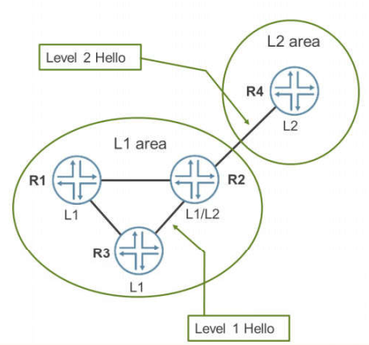

DIS

- IS-IS elects a DIS on broadcast and multiaccess networks

- In a priority tie, the system with the highest SNPA or MAC address wins the DIS election

- Priority range of 0 through 127.

- Junos OS uses a default priority of 64 for both levels.
- If the priority is 0, the router is ineligible to become the DIS
- Interfaces to nonbroadcast networks automatically have a priority of 0

- Separate DIS is elected for L1 and L2 (could be the same router)

- DIS characteristics:

- DIS acts as the representative of the pseudo-node and advertises the pseudo-node to all attached routers

- In IS-IS, a router multicasts its LSPs directly to all the routers on the LAN. They don’t need to be re-advertised by the DIS. Way more efficient! Instead, the DIS just sends out a CSNP, a Complete Sequence Number PDU, every 10 seconds so that all routers can be sure that they do indeed have the latest and greatest information.

- No backup DIS in IS-IS

- There’s no need for a backup DIS. All routers take care of sending their own information to the LAN.

- Election is deterministic/preemption (unlike OSPF)

Pseudo-Node

- An IS-IS network running on a broadcast segment is considered a single router (called a pseudo-node)

- Each router advertises a single link to the pseudo-node, including the DIS
- Each router forms an adjacency with each of its neighbors on a broadcast, multi-access network

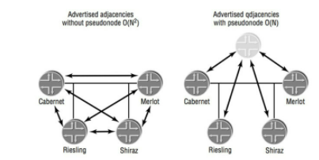

Troubleshooting IS-IS Adjacencies

- If no adjacency exists, check for the following:

- Physical Layer and Data Link Layer connectivity
- Mismatched areas (if L1 router) and levels
- Failure to support minimum protocol MTU of 1492
- Lack of IP configuration on interfaces
- Lack of, or malformed, ISO-NET

- No NET configured

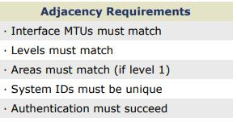

Configuring IS-IS

- You must include the ISO family on all interfaces on which you want to run IS-IS and a NET on one of the router’s interfaces (usually loO)

- Junos OS supports the assignment of multiple ISO NETs to the router’s loopback interface

- By default, all IS-IS interfaces are Level 1 and Level 2 interfaces

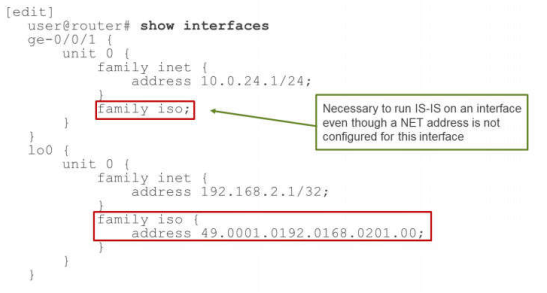

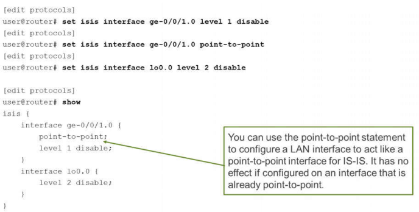

Reference Bandwidth

- You can change the interface cost to use the formula *reference-bandwidth/bandwidth*

- Automatically alters the cost of interfaces
- Allows for a consistent change across all interfaces

- Use the **reference-bandwidth** command within the **[edit protocols isis]** hierarchy

IS-IS Metric

- Metric of an interface indicates the overhead required to send packets out that interface
- Default IS-IS metric for all links is 10

- Includes passive interfaces
- Exception is the loopback interface

- Default metric is 0

- Can set metric on a per-interface basis

- Each level on an interface can also have a different metric

Monitoring IS-IS Operation

- Various **show** commands exist to provide detailed information on the operation of IS-IS
- **show isis interface**
- **show isis adjacency**
- **show isis spf log**
- **show isis statistics**
- **show isis route**
- **show isis database extensive**
