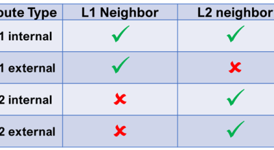
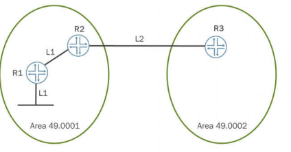
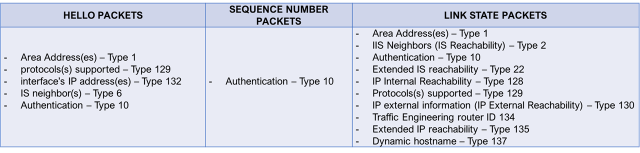
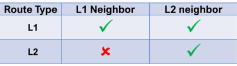

# Chapter 8: Multilevel IS-IS Networks

---

**Chapter 8:Â** **Multilevel IS-IS Networks**

---

**Multilevel Operation**

- An L1/L2 IS-IS network operates in a similar fashion to an OSPF NSSA with no summaries
    - Local L1 routes are advertised into Level 2
    - External routes can be advertised into an L1 area
- The L1/L2 border is a natural route boundary
    - L2 routes are not advertised into L1 areas by default
    - External L1 routes are not advertised to Level 2 by default
        - Route leaking policies are used to modify this default behavior
        - Using only wide metrics eliminates internal/external distinction
- L1/L2 attached routers set the attached bit in their L1 LSPs
    - L1 routers install a locally generated 0/0 default route to the closest L2 attached router
        - Disable with **ignore-attached-bit** command



**IS-IS Multilevel Configuration**

- Each IS-IS interface operates at both Level 1 and Level 2 by default
    - Disable a specific level to stop an interface from operating at that level
    - lo0 interface will be passive at both levels in this example
        - Disable at a particular level to prevent lo0 address advertisement in that level

**Route leaking**

- Level 2 routes are not advertised into Level1 areas by default.
    - In this example, the network operator wants to advertise, or leak, Level 2 routes into Area 49.0001.
        - This action will require a routing policy on the L1/L2 area border router (ABR)
        - Specifying that the matching routes are Level 2 and will be advertised in Level 1.
    - Use the **from level 2/to level 1** syntax
- Routes advertised from an L2 area into an L1 area have the <span style="background-color: #ffaaaa">up/down bit set to down</span>
    - Ensures that another L2 router will not re-advertise the route back into an L2 area to <span style="background-color: #ffaaaa">avoid routing loops</span>



**Route sumarization**

- The L1/L2 area border is a natural place to summarize routing information
    - Override the default route flooding between the areas with a routing policy
- Create aggregate routes in local routing table
    - Policy required to advertise aggregate routes into another level - use **from/to** level for maximum control
- Unlike OSPF, there is no area-range statement to summarize routes in IS-IS. Summarizing routes in IS-IS requires a three step process:
    - creating an aggregate route
    - creating a matching policy
    - then exporting that policy into IS-IS.

**Internal Level 1 routesummarization**

- Internal Level 1 routes can be summarized
    - Requires routing policy and a local aggregate route
    - For example, suppress specific routes in the 10.0.4.0/22 block and advertise a
- single 10.0.4.0/22 summary route

**Route Leaking and Summarization**

- Level 1 link-state PDUs (LSPs)

**IS-IS Best Practices**

- Enable wide metrics

```
[edit]
user@router# set protocols isis level 2 wide-metrics-only
```

- Increase the LSP lifetime, from 1200 seconds (default), to reduce the amount of control traffic generated

```
[edit]
user@router# set protocols isis lsp-lifetime 4000
```

- Adjust how quickly IS-IS performs an SPF calculation after detecting a topology change (200 ms default)

```
[edit]
user@router# set protocols isis spf-options delay 50
```

- Use the overload timeout value option to prevent traffic from transiting a newly booted router

```
[edit]
user@router # set protocols isis overload timeout 600
```

- Use the ignore-attached-bit option to avoid certain cases of sub-optimal routing

```
[edit]
user@router# set protocols isis ignore-attached-bit

* Enable BFD on interfaces to reduce failure detection times
[edit protocols isis]
user@router# show
interface ge-1/1/1.0 {
    bfd-liveness-detection {
        minimum-interval 30;
        multiplier 3;
    }
}
```

- Use authentication

```
[edit protocols isis]
user@router# show interface ge-1/1/2
level 2 {
    hello-authentication-key "$9$km5FCt0cyKn/yKM8dVqmf"; ## SECRET-DATA
    hello-authentication-type md5;
}
```

---

**show isis database level 1** **mxE-R5-l**.**00-00** **extensive | find tlv**

The four /24 RIP routes are installed in the R5-1 router’s LSP as Type 130 TLVs (IP external prefix) and as Type 135 TLVs (IP extended prefix). Because both the external and extended TLVs exist, only the TLV 130 values are used in the SPF algorithm

by default, external routes are not leaked between the Level 1 database and the Level 2 database.

IS-IS Level 1 internal routes are redistributed into the Level 2 database by default.

By default, the L1/L2 routers do not leak Level 2 learned routes into the Level 1 database.

Because the default IS-IS flooding scope is to leak Level 1 internal Type 128TLVs into the Level 2database,the down bit is set in order to prevent routing loops. IS-IS Level1Type 128 TLVs with the down bit set are never leaked back into the Level 2 database as a loop detection mechanism.



---

**WIDE METRICS AND ISIS ROUTE PROPAGATION RULES.**

By default:

1) L1 **interna**l routes are advertised to both L1 and L2 neighbors   

2) L1 **external** routes are advertised to L1 neighbors but NOT to L2 neighbors  

3) L2 (**both internal and external**) routes are advertised to L2 neighbors but NOT to L1 neighbors


The rule that we care about right now is the one about L1 external routes which we can state this way:

**L1 routes that were injected into ISIS via redistribution, are treated by default as L1 external routes, and are NOT advertised to L2 neighbors by default.**

We know now that the difference between internal and external routes disappears when we configure wide metrics only.

And if there is no difference between L1 routes that are created because ISIS was configured on an interface (internal) or redistributed into ISIS, all L1 routes are treated equally and are now advertised to L2 neighbors.



**Configuring wide-metrics-only affects what the router advertises, not what the router accepts and uses for route calculation purposes.**

Source: [https://momcanfixanything.com/isis-narrow-and-wide-metrics/](https://momcanfixanything.com/isis-narrow-and-wide-metrics/)
