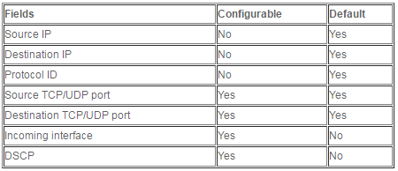
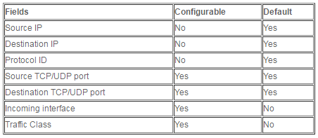
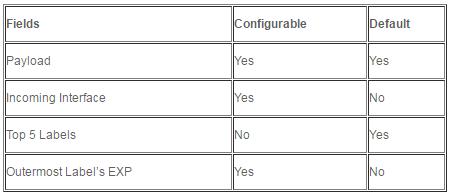
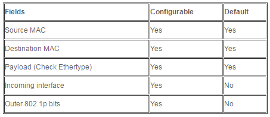

# Hash key computation on MPC cards

[https://www.configrouter.com/hash-key-computation-mpc-cards-877/](https://www.configrouter.com/hash-key-computation-mpc-cards-877/)

###

The article provides information on **how the hash key is computed on MPC cards,** the default parameters being used to compute the hash, and the various options, which are available under the **forwarding-options>enhanced-hash-key** hierarchy to influence the hashing results.

Information on how the hash key is computed on MPC cards, the default parameters being used to compute the hash, and the various options, which are available under the **forwarding-options>enhanced-hash-key** hierarchy to influence the hashing results.

Hashing is always performed on the ingress FPC, if the next-hop for the destination is identified as an ECMP or aggregate interface next-hop. The following fields are used for computing the hash key for different packet types:

**For IPv4:**

**For IPv6:**

**For MPLS:**

**For Ethernet (Bridge, CCC, TCC, VPLS) which is configured by using the family multiservice:**

**Note:**

1. The Source MAC/ Destination MAC cannot be separately enabled or disabled. To remove SMAC/DMAC from hash computation, the following options need to be configured:

set forwarding-options enhanced-hash-key family multiservice no-mac-addresses

The **no-mac-addresses** knob is hidden.

2. Payload recognition uses the following criteria to estimate the nature of the payload:

- The payload is assumed to be IPv4 if the first nibble following the bottom label is **0x4**. If this determination is made, then the fields in the IPv4 section are used for load balancing.
- The payload is assumed to be IPv6 if the first nibble following the bottom label is **0x6**. If this determination is made, then the fields in the IPv6 section are used for load balancing.
- Otherwise, Ethernet is assumed and an attempt is made to parse the remaining bytes as an Ethernet header. Additionally, the following checks are performed for Ethernet headers and if matched, the appropriate L3 payloads are used for load balancing:
- Check for **0x0800** after the first 12 bytes; if found, then the payload is IPv4 (i.e fields in the IPv4 section are used for load balancing)
- Check for **0x86DD** after the first 12 bytes; if found, then the payload is IPv6 (i.e fields in the IPv6 section are used for load balancing)
- Check for **0x8100** after the first 12 bytes; if found, skip over (up to 2) VLAN tags and check for real Ethertype.
- The MAC address is ignored for L2VPN applications, when Ethernet is present inside MPLS. But it will be considered for VPLS. (note: For a P router, MAC addresses are not used for either application. This is applicable for a PE device which is terminating L2VPN/VPLS, and forwarding to a LAG connecting to the customer)

3. The configurable parameters, mentioned in this article, are available under the **forwarding-options>enhanced-hash-key** stanza:

lab@mx960-re0# set forwarding-options enhanced-hash-key family ?

Possible completions:

> inet IPv4 protocol family

> inet6 IPv6 protocol family

> mpls MPLS protocol family

> multiservice Multiservice protocol (bridged/CCC/VPLS) family
