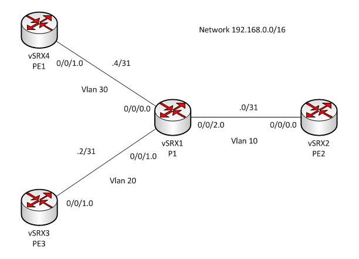
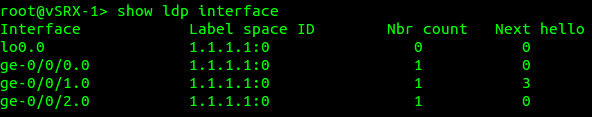
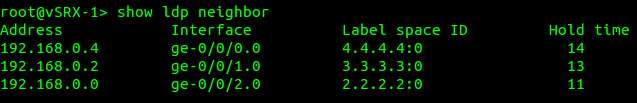
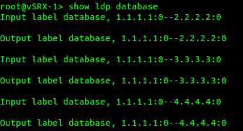
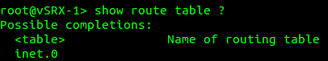
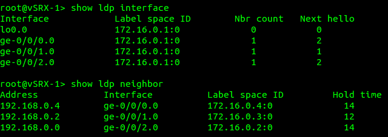

# Junos – LDP troubleshooting

[http://www.networknoob.net/2015/07/junos-ldp-troubleshooting/](http://www.networknoob.net/2015/07/junos-ldp-troubleshooting/)

I have been working my way through the Day one: MPLS for enterprise engineers and the first basic configuration is for LDP.  I setup the four router topology on my macbook pro and then on my day off I decided to run through it again on my home server for some extra practice.  I will firstly mention that I had forgotten that these vSRX devices had been previously configured with a random topology I was using a few weeks back.

I ran through the 3 basic commands to configure ldp and enable mpls on the routers, firstly on the P router and then on the PE routers.

I used **show ldp interface** and confirmed that LDP was running on all the core facing links (all the links from the PE routers back to the P router) but not active on the customer facing links:

I could see that the LDP neighbours with the **show ldp neighborÂ** command:

At this point not having a lot of experience configuring or troubleshooting LDP I expected that all was well, however this was not the case.  As I continued on through the day one guide, verification of the LDP database did not look as expected.  In fact there was no label exchange happening at all.  Closer inspection showed that there were no bindings in the database:

The reason I noticed this was because when I was checking for the inet.3 route table neither mpls.0 or inet.3 route tables existed.

At this point I double checked all my configuration as per the day one guide and all the config I had was right.  Reachability was working as expected, pings between all interfaces were working as expected.  I noticed that the loopback IPs in the day one guide were all set to 172.16.0.x/32 on each box so I went ahead and configured these but still no dice, No matter what I tried I could not see anything in the ldp database.

Now remember earlier I said these devices had previously been used in another topology?  Well when I checked the output of **show ldp neighbor** I could see the neighbour listed on the correct interface, however I could not work out where the 1.1.1.1 and 2.2.2.2 neighbour addresses were coming from or why the label space ID was showing these addresses…

Long story short, I review the configuration on the devices again and found that I had the router ID specified under the **routing-options** hierarchy for each device, eg: vsrx 1 = 1.1.1.1, vsrx2 = 2.2.2.2 and so on.  The issue here is that these prefixes are not actually reachable as they were only used as the router id on the box and they are not present on any of the interfaces or in the routing table.

Once the router ID was removed from under the **routing-options** section, we saw the label space ID correctly list the respective loopback IP address in both **show ldp neighbours** and **show ldp interface**, the ldp database was populated and we could also see the inet.3 and mpls.0 route tables were now available.

I still don’t understand why the devices were trying to use the router-id specified under the routing-options hierarchy in the first place, as the IP on the loopback interfaces were completely different.

According to the day one guide, LDP in Junos attempts to setup the LDP session between the loopback address of each router so obviously if the loopback addresses are not advertised into the IGP they will not form an adjacency.  Junos in this case was taking the router id set in the routing-options hierarchy and enabling this as the loopback interface IP  (which is was not, there was a different IP set on the interface itself) hence the adjacency did not form.

For whatever reason even though the loopback addresses were configured, advertised and reachable via the IGP from each router, LDP was choosing to use the IP address configured in the router-id section of the config which was not advertised or reachable.

If anyone knows why this is the case please feel free to ping me and let me know.
