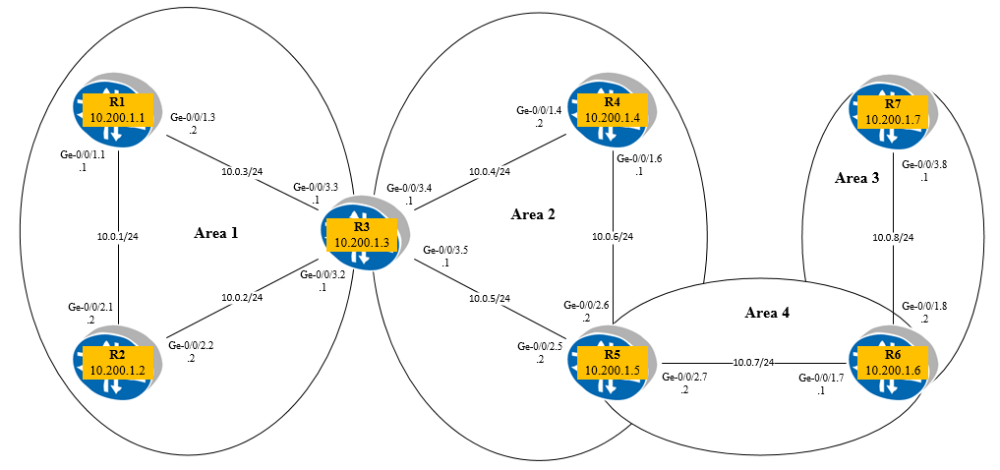
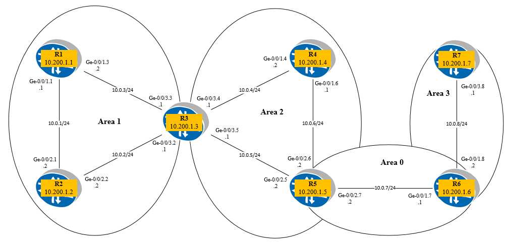

# OSPF LSA Type 3 ABR technical vs functional

**Trường hợp 1:** non-backbone

+ ABR chỉ convert LSA type1, type 2 sang type 3 và quảng bá sang area kế cận nó (ko quảng bá LSA type 3 từ area khác). Ví dụ: R5 **KHÔNG** flood LSA type 3 nhận được từ R6 (do R6 quảng bá LSA type 3 từ Area 3 à area 4) sang area 2. Tương tự với R3 và R6.

**Trường hợp 2:** Multiarea

+ ABR R3 vẫn hoạt động như trường hợp 1: R3 **KHÔNG** flood LSA type 3 nhận được từ R5 (do R5 quảng bá LSA type 3 từ Area 0 à area 2) sang area 1.

+ ABR R5 ko đưa LSA type 3 từ R3 quảng bá vào Area 2 để tính toán SPF (do lúc này R5 đã được kết nối với area0, do đó nó chỉ accept LSA type 3 từ backbone), đổng thời ABR R5 quảng bá LSA type 3 từ area 0 -> area 2 (như normal behavior của OSPF).
