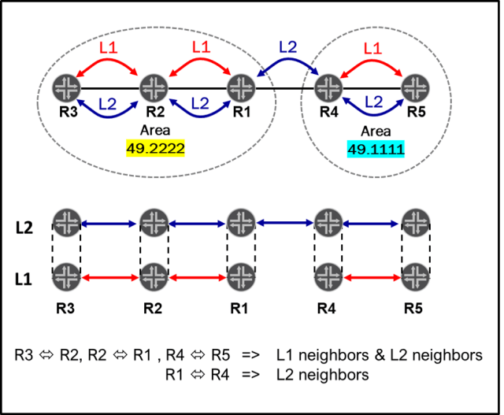
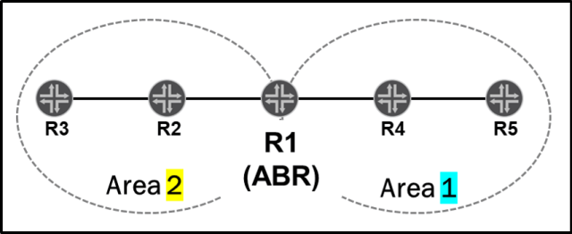
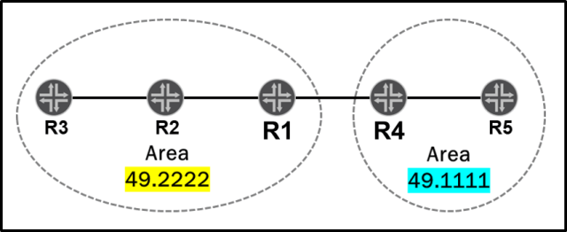
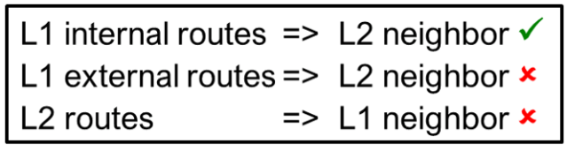
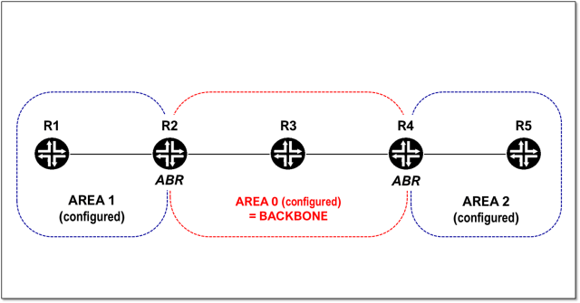
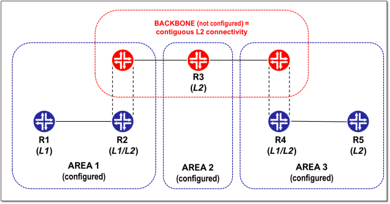
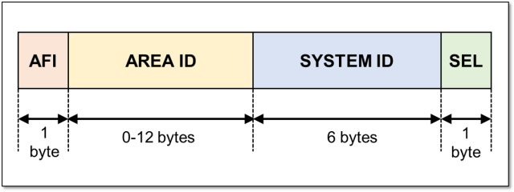
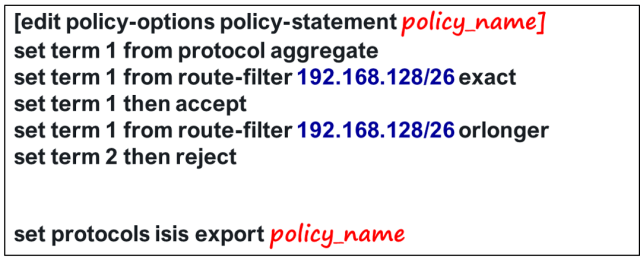

# OSPF vs. ISIS

source: [https://momcanfixanything.com/ospf-vs-isis/](https://momcanfixanything.com/ospf-vs-isis/)

Long ago, when I didn’t know much about ISIS, and I mostly worked with customers running OSPF, I used to think of ISIS as a strange routing protocol, that nobody really cared much about. But I was sooo wrong!

I started studying ISIS in depth as I progressed in the service provider certification tracks, and obviously when I got to the E-level I had to know ISIS very well. Then, I had the chance to work for a major Service Provider in the US, and discovered that not many people actually knew much about OSPF, but were well versed in ISIS.

The more I learned about it, and the more I worked with it supporting my customer, the more I liked it. I came to realize that ISIS is actually a pretty awesome routing protocol. And I would like people to understand it better, and embrace it. I am sure that anyone who’s being in the Service Provider world, is already on board.

Students have always asked me: “If I am familiar with OSPF, would that help me understand ISIS? Do the concepts in OSPF, apply to ISIS? or are they way different?�

I guess I will answer those questions with YES! YES! and YES!

In some ways, the two protocols are very similar, and the concepts you already know in OSPF apply very closely, but at the same time, they are very different.

So, let me try to summarize the similarities and differences for you:

## **SIMILARITIES:**

Both routing protocols are IGP (Internal Gateway Protocols) and Link State Protocols, which means they both advertise link information and build a Link State Database. The exchange of information is reliable, and the routers will make sure that the databases are synchronized.

They both run the SPF (Shortest Path First) algorithm to calculate the best path to each destination network, and to make that determination they add the metrics of the different links.

Also, before routers can exchange actual link information they form an adjacency, or formal neighbor relationship, which is built using hello packets. Both OSPF, and ISIS use hello packets for discovering neighbors and maintaining the relationship with those neighbors.

Also, when you implement OSPF or ISIS, you do so following a 2-level hierarchical model (backbone/non-backbone areas in OSPF, and LEVEL 1/LEVEL 2 in ISIS)

They also have many common features and options, just implemented in different ways.

To summarize, both protocols:

- Are IGP Link State routing protocols and build a Link State Database
- Have reliable updates
- Run SPF to calculate best routes.
- Use hello packets to create adjacencies
- Have a two level hierarchical model
- Support authentication and route summarization
- Use multicast addresses
- Elect a designated device on multiaccess networks.
- Can differentiate internal and external routes and tag routes
- Support features like graceful restart, GRES/NSR, Traffic Engineering, IPv6, and so on.

Thus, yes, there are a lot of similarities! But, as I said: they are also very different. Let’s take a look at that now:

## **DIFFERENCES:**

|

                                                                                                                                                                                                                                                                                                                                                                                                                                                                                                                                                                                                                                                                            |

                                                                                                                                                                                                                                                                                                                                                                                                                                                                                                                                                                                         |
|-----------------------------------------------------------------------------------------------------------------------------------------------------------------------------------------------------------------------------------------------------------------------------------------------------------------------------------------------------------------------------------------------------------------------------------------------------------------------------------------------------------------------------------------------------------------------------------------------------------------------------------------------------------------------------------------------------------------------|--------------------------------------------------------------------------------------------------------------------------------------------------------------------------------------------------------------------------------------------------------------------------------------------------------------------------------------------------------------------------------------------------------------------------------------------------------------------------------------------------------------------------------------------------------------------------------------------------------------------------------|
|* **Internal router**: A router with all its interfaces within the same area

* **Backbone router**: A router with at least one interface connected to the backbone area.

*** Internal Backbone router**: A router that with all its interface within the backbone area.

* **Internal Non-backbone router**: A router with all its interfaces within an area other than the backbone

* **ABR (Area Border Router)**: A router connected to more than one area

(commonly one of those areas is the backbone area)

*** ASBR (Autonomous System Boundary Router)**: Any router injecting routes into the OSPF domain via redistribution.
**ROUTER TYPES:**                                                                        |* **L1 router**: A routers that can only form adjacencies with other routers in the

same area.

Similar to an internal router.

* **L2 router**: A router that can form adjacencies with routers in the same area & with router in other areas.

Similar in concept to a internal backbone router.

* **L1/L2 router**: A routers that can form adjacencies with L1 routers and also with L2 routes.

Similar in concept to an ABR.

NOTE: refer to the adjacency formation section for more details.
**ROUTER TYPES:**                                                                                                                       |
|* p2p

* broadcast (LAN) – default for ethernet

* NBMA

* p2mp
**INTERFACE TYPES:**                                                                                                                                                                                                                                                                                                                                                                                                                                                                                                                                                                                                                                          |* p2p

* broadcast (LAN) – default for ethernet

**INTERFACE TYPES:**                                                                                                                                                                                                                                                                                                                                                                                                                                                                                                                                                               |
|**BROADCAST NETWORK**:                                                                                                                                                                                                                                                                                                                                                                                                                                                                                                                                                                                                                                                                                                 |**BROADCAST NETWORK:**                                                                                                                                                                                                                                                                                                                                                                                                                                                                                                                                                                                                          |
|* A **Designated (DR)** and a **Backup Designated Router (BDR)** are elected                                                                                                                                                                                                                                                                                                                                                                                                                                                                                                                                                                                                                                           |* A **Designated Intermediate System (DIS)** is elected.                                                                                                                                                                                                                                                                                                                                                                                                                                                                                                                                                                        |
|* DR and BDR have adjacencies with all routers in the network
* Routers establish** adjacencies** (Full State) **only with the DR & BDR** in the broadcast network                                                                                                                                                                                                                                                                                                                                                                                                                                                                                                                                                      |

* Routers establish **adjacencies with ALL other routers** in the broadcast network.                                                                                                                                                                                                                                                                                                                                                                                                                                                                                                                                            |
|* There is a **BDR**                                                                                                                                                                                                                                                                                                                                                                                                                                                                                                                                                                                                                                                                                                   |* There is **NO Backup (DIS)**                                                                                                                                                                                                                                                                                                                                                                                                                                                                                                                                                                                                  |
|* There is a **DR/BDR per segment**                                                                                                                                                                                                                                                                                                                                                                                                                                                                                                                                                                                                                                                                                    |* **DIS per level, per segment**                                                                                                                                                                                                                                                                                                                                                                                                                                                                                                                                                                                                |
|* Router with highest priority is elected.

* If priority is the same, then router with highest **router**-id is elected

* **Priority of 0 means ineligible**
* **Default priority for DR election** = 128 (range 1-255)                                                                                                                                                                                                                                                                                                                                                                                                                                                                                                   |* Router with highest priority is elected.

* If priority is the same, then router with **highest MAC address** is elected.

* **Priority of 0 does NOT mean ineligible**
* **Default priority for DR election** = 64 (range 0-127).                                                                                                                                                                                                                                                                                                                                                                                                 |
|* There is **no preemption for the DR**                                                                                                                                                                                                                                                                                                                                                                                                                                                                                                                                                                                                                                                                                |* There is **preemption for the DIS**                                                                                                                                                                                                                                                                                                                                                                                                                                                                                                                                                                                           |
|* V2 only supports IPv4.

* V3 supports IPv4 and IPv6
**PROTOCOLS SUPPORT:**                                                                                                                                                                                                                                                                                                                                                                                                                                                                                                                                                                                                                                              |* IPv4, IPv6 & CNLS

**PROTOCOLS SUPPORT:**                                                                                                                                                                                                                                                                                                                                                                                                                                                                                                                                                                                       |
|* Same Area ID

* Same timers (hello and dead intervals)

* Same Area type (options bits)

* Authentication type, and key

* Unique RID

* Matching MTU

* Matching IP subnet and subnet mask

**ADJACENCY FORMATION REQUIREMENTS/RULES:**                                                                                                                                                                                                                                                                                                                                                                                                                                                                                           |* For** LEVEL 1** adjacencies: routers must be in the **same area**

* For **LEVEL 2** adjacencies: routers can be in the **same area or in different areas**.

* By default, a Juniper router is configured as an L1/L2 router.

=> By default, between two Juniper router running ISIS, two adjacencies will be formed (L1 and L2)

* Minimum MTU of 1492 is required

* NET configured under lo0.0 must be configured

In the example, all routers are L1/L2 but an L1 adjacency between R1 and R4 cannot form because they are in different areas.
**ADJACENCY FORMATION REQUIREMENTS/RULES:**|
|**AREAS:**                                                                                                                                                                                                                                                                                                                                                                                                                                                                                                                                                                                                                                                                                                             |**AREAS:**                                                                                                                                                                                                                                                                                                                                                                                                                                                                                                                                                                                                                      |
|– An internal router has all interfaces within an area.

– An ABR has interfaces in the backbone area, and interfaces on one or more non-backbone areas.

– **Boundary between areas** is on the ABR.

* **Area assignment:**                                                                                                                                                                                                                                                                                                                                                                                                                                                   |– A router is completely within an area.

– All interfaces in the same area (always).

– **Boundary between areas** is on the links.

* **Area assignment:**                                                                                                                                                                                                                                                                                                                                                                                                                             |
|– Associated with the interfaces

– An interface belongs to only one are (a secondary area is possible with multiarea adjacencies)

* **Area ID:**                                                                                                                                                                                                                                                                                                                                                                                                                                                                                                                                  |– Associated with the router not the interfaces

– A router can belong to multiple areas

* **Area ID:**                                                                                                                                                                                                                                                                                                                                                                                                                                                                                       |
|– ABRs advertise inter-area routing information to internal routers using LSAs type 3

– If an area is configured as a stubby no-summary (totally stubby area), these LSAs are replaced with a default route, if configured

NOTE: refer to the DEFAULT ROUTE section.

– Policies can be applied to control which LSA3 are created by the ABR.
* **Inter-area information:**                                                                                                                                                                                                                                                                                                                                                 |– L1/L2 routers do NOT advertise L2 routes to L1 routers by default (Behavior is equivalent to NSSA no summaries).

> A policy can be configured to leak routes from LEVEL 2 into LEVEL 1

– L1/L2 routers advertise internal L1 routes to L2 neighbors by default.

– L1/L2 routers do NOT advertise external L1 routes to L2 neighbors by default.

> A policy can be configured to stop routes from LEVEL 1 into LEVEL 2 or to leak external routes.

NOTE: with wide-metrics-only there is no difference between internal and external routes.

* **Inter-level information:**               |
|– **Regular Area:** LSAs type 1, 2,3,4, & 5

– **Stub Area:** LSAs type 1, 2, & 3

– **Stub Area no-summary**

**(totally stubby area):** LSAs type 1, 2, & 3

(only 0/0)

– **Not So Stubby Area (NSSA):** LSAs type

1, 2, 3, & 7

– **NSSA no-summary:** LSAs type 1, 2, 7, & 3

(only 0/0). 0/0 can be changed to 7.
*** Area Types:**                                                                                                                                                                                                                                                                                                                                                                                              |N/A                                                                                                                                                                                                                                                                                                                                                                                                                                                                                                                                                                                                                             |
|**HIERARCHICAL DESIGN:**                                                                                                                                                                                                                                                                                                                                                                                                                                                                                                                                                                                                                                                                                               |**HIERARCHICAL DESIGN:**                                                                                                                                                                                                                                                                                                                                                                                                                                                                                                                                                                                                        |
|* Backbone – > Non Backbone area

* Boundary = ABR

* Area 0 required                                                                                                                                                                                                                                                                                                                                                                                                                                                                                                                                                                                                         |* LEVEL 2 -> LEVEL 1

* There is no backbone or area 0 configured

* Boundary = L1/L2 router.

* Area 0 NOT required                                                                                                                                                                                                                                                                                                                                                                                                                                                                     |
|**TIMERS**:                                                                                                                                                                                                                                                                                                                                                                                                                                                                                                                                                                                                                                                                                                            |**TIMERS**:                                                                                                                                                                                                                                                                                                                                                                                                                                                                                                                                                                                                                     |
|– 10 sec (broadcast and p2p)

– 30 sec (NBMA)

Configurable
* **Hello interval:**                                                                                                                                                                                                                                                                                                                                                                                                                                                                                                                                                                                                                                           |– 3 seconds (for DIS routers)

– 9 seconds (for non-DIS routers)

Configurable
* **Hello interval:**                                                                                                                                                                                                                                                                                                                                                                                                                                                                                                                                 |
|– 40 sec (broadcast and p2p)

– 120 sec (NBMA)

Configurable
* **Dead interval (3 x hello interval)**:                                                                                                                                                                                                                                                                                                                                                                                                                                                                                                                                                                                                                      |– 9 seconds (for DIS routers)

– 27 seconds (for non-DIS routers)

Configurable
* **Hold time (3 x hello interval)**:                                                                                                                                                                                                                                                                                                                                                                                                                                                                                                                |
|* **Age starts at 0 and increments up to maxage.**                                                                                                                                                                                                                                                                                                                                                                                                                                                                                                                                                                                                                                                                     |* **Age is set to max. age and gets decremented up to 0**                                                                                                                                                                                                                                                                                                                                                                                                                                                                                                                                                                       |
|Configurable
* **Maximum Age** = 3600 sec (60 min)                                                                                                                                                                                                                                                                                                                                                                                                                                                                                                                                                                                                                                                                      |Configurable
* **LSP Lifetime** = 1200 sec (20 min)                                                                                                                                                                                                                                                                                                                                                                                                                                                                                                                                                                              |
|Configurable
* **Default LSA Refresh Interval** = 3000 sec (50 min)                                                                                                                                                                                                                                                                                                                                                                                                                                                                                                                                                                                                                                                     |(lifetime minus 317)
* **Default LSP Refresh Interval**= 883 sec                                                                                                                                                                                                                                                                                                                                                                                                                                                                                                                                                                 |
|N/A                                                                                                                                                                                                                                                                                                                                                                                                                                                                                                                                                                                                                                                                                                                    |– on broadcast interfaces = 10 sec

– on point-to-point interface = 5 sec
*** CSNP Interval:**                                                                                                                                                                                                                                                                                                                                                                                                                                                                                                                                     |
|* Internal = 10

* External = 150

Configurable

**ROUTE PREFERENCES:**                                                                                                                                                                                                                                                                                                                                                                                                                                                                                                                                                                                                                                                      |* Level 1 internal = 15

* Level 2 internal = 18

* Level 1 external = 160

* Level 2 external = 165

Configurable
**ROUTE PREFERENCES:**                                                                                                                                                                                                                                                                                                                                                                                                                                                                                                |
|indicated with metric = 65535
**OVERLOAD:**                                                                                                                                                                                                                                                                                                                                                                                                                                                                                                                                                                                                                                                                             |Indicated with overload bit
**OVERLOAD:**                                                                                                                                                                                                                                                                                                                                                                                                                                                                                                                                                                                        |
|* Not specified by standard

* Referred as cost.

* Most vendors use cost = **10^8/Bandwidth** (by default), where **10^8** is the reference bandwidth.

* Default metric for lo0 interface = 0

* You can configure the metric of the interface, the reference bandwidth, or the bandwidth of the interface.

**METRICS:**                                                                                                                                                                                                                                                                                                                                                                                                      |* Specified by standard ISO 10589

* 4 types of metrics defined:

–**Default:**  Mandatory.

Default for ALL interfaces = 10

_(configurable value)_

– **Delay:** not used

– **Expense**: not used

– **Error:** not used

* You can also configure the metric to be calculated automatically as **10^8/Bandwidth**

* Metrics can be configured on a per level basis.
**METRICS:**                                                                                                                                                                                                                                                              |
|

* **Maximum metric** = 65,535                                                                                                                                                                                                                                                                                                                                                                                                                                                                                                                                                                                                                                                                                          |* **Maximum metric on an interface** = 63

Limit technically removed with wide-metric-only (~16 million maximum value)
* **Maximum Total Metric on a path** = 1023                                                                                                                                                                                                                                                                                                                                                                                                                                                                 |
|* Encapsulated within **IP PACKETSÂ** using:

– Protocol = 89

– Multicast DA = 224.0.0.6 (DR/BDRs)

– Multicast DA = 224.0.0.5 (All OSPF routers)

**DESTINATION ADDRESS/PROTOCOL**:                                                                                                                                                                                                                                                                                                                                                                                                                                                                                                                                          |* Encapsulated within **Layer 2 framesÂ** using:

– DSAP/SSAP= 0xFE

– Multicast DA = 0180.c200.0014 (LEVEL 1)

– Multicast DA = 0180.c200.0015 (LEVEL 2)

* Requires GRE encapsulation to run on connections such as IPSEC tunnels.
**DESTINATION ADDRESS/PROTOCOL**:                                                                                                                                                                                                                                                                                                                                                                   |
|* When configured, an **ABR can inject a default route into a stub area or a NSSA,Â** â€“ For Stub Area => LSA type 3

– For NSSA => LSA type 7

– For NSSA no-summary => LSA type 3
**DEFAULT ROUTE:**                                                                                                                                                                                                                                                                                                                                                                                                                                                                                                                       |* An **L1 router installs a default route in its routing table when it receives an update from an L1/L2 router with the attached bit set.**

* Can be** disabled with the ignored-attached-bit** command
**DEFAULT ROUTE:**                                                                                                                                                                                                                                                                                                                                                                                                        |
|* **primary address** of **lo0.0 interface** OR

* **router-id** configured **under routing-options.**

**ROUTER ID:**                                                                                                                                                                                                                                                                                                                                                                                                                                                                                                                                                                                                     |*** iso address** (NET) of **lo0.0 interface**

**ROUTER ID:**                                                                                                                                                                                                                                                                                                                                                                                                                                                                                                                                           |
|* Supported, but needs to be configured.

* Use LSA Type 10.

**TRAFFIC ENGINEERING:**                                                                                                                                                                                                                                                                                                                                                                                                                                                                                                                                                                                                                                     |* Supported by default.

* Use TE **Sub-TLV** within the **Extended IS Reachability (TLV 22)** and the **Extended IP Reachability (TLV 135)**
**TRAFFIC ENGINEERING:**                                                                                                                                                                                                                                                                                                                                                                                                                                                             |
|**ROUTING POLICIES:**                                                                                                                                                                                                                                                                                                                                                                                                                                                                                                                                                                                                                                                                                                  |**ROUTING POLICIES:**                                                                                                                                                                                                                                                                                                                                                                                                                                                                                                                                                                                                           |
|– ALL routes are rejected = NO

redistribution by default

– An export policy would enable

redistribution and create LSAs type 5/7

– LSAs are still created for interfaces

running OSPF, and sent out (**cannot**

modified by policies).

– Writing and applying a policy that

rejects everything:
**does NOT stop the advertisement of**

**interfaces running OSPF**

*** Default Export Policy:**                                                                                                                   |-ALL routes (except direct routes for

interfaces running ISIS) are rejected =

NO redistribution by default

– LSPs are created for interfaces running

ISIS, and sent out **(can be affected by**

**policy**).

– An export policy can control which

prefixes are actually advertised (even

for interfaces running ISIS), configures

redistribution and creates external

routes – w/ narrow metrics)

– Writing and applying a policy that

rejects everything:

**stops the advertisement of**

**interfaces running OSPF**
*** Default Export Policy:**                                            |
|– All routes from SPF calculations are

accepted and imported into the

routing table.

– LSAs sent by neighbors are accepted

and placed in the LSDB, and SPF

calculates routes (not affected by

policies).

– Import policies can be configured, but

only for external routes.
*** Default import policy:**                                                                                                                                                                                                                                                                                                                                                                                                                        |– All routes from SPF calculations are

accepted and imported into the

routing table.

– LSPs sent by neighbors are accepted

and placed in the LSDB, and SPF

calculates routes, routes. (not affected

by policies).

– Import policies could NOT be

configured for ISIS until Junos 17.1
*** Default import policy:**                                                                                                                                                                                                                                                                                                                       |
|* Simple test OR MD5 OR IPSEC

* Per area OR per interface (all router in an area must have same authentication configured)

* Applies to ALL packets

**AUTHENTICATION:**                                                                                                                                                                                                                                                                                                                                                                                                                                                                                                                                                   |* Simple test OR MD5

* Per level or per interface:

– Per level applies LSPs, CNPs and Hello messages (can be disable for a specific type of packet)

– Per interface applies only for hello messages
**AUTHENTICATION:**                                                                                                                                                                                                                                                                                                                                                                                                             |
|* **area-range** under the area

configuration level

Summarizes the prefixes injected into

other areas by the ABR (LSAs type 3).

ABR learns about these prefixes from

LSAs type 1 and type 2.

* **area-range** under the nssa area

configuration level

Summarizes the prefixes injected into

an area, by the ABR, when translating

from LSAs type 7 into LSAs type 5.

* NO other LSAs can be summarized!

* ONLY the ABR can summarize!

* Specific prefixes within the range automatically suppressed.

* The **restrict** option can be used with the area range to stop any updates for prefixes within the range.
**ROUTE AGGREGATION**:|* NO specific command for route

summarization.

* To summarize prefixes

1) Create an aggregate and redistribute

with policy

2) Redistribute the aggregate into ISIS using a policy:

**ROUTE AGGREGATION:**                                                                                                                                                                                                                                                                                                                                                                                |
|**ROUTING INFORMATION:**                                                                                                                                                                                                                                                                                                                                                                                                                                                                                                                                                                                                                                                                                               |**ROUTING INFORMATION:**                                                                                                                                                                                                                                                                                                                                                                                                                                                                                                                                                                                                        |
|– Type 1 = Hello

– Type 2 = Database Description

– Type 3 = Link State Request

– Type 4 = Link State Update

– Type 5 = Link State Acknowledge

* **Packet Types:**                                                                                                                                                                                                                                                                                                                                                                                                                                                                                                                                                           |– Hello broadcast network:

For L1 and L2

– Hello point-to-point network

– LSPs (Link State Packets):

Like OSPF LSAs

For L1 and L2

Include reachability TLVs.

– PSNP (Partial Sequence Number PDU):

Like OSPF Request/Update/Ack

– CSNP (Complete Seq. Number PDU):

Like OSPF DBD

Only sent by DIS on broadcast net.

Periodic

For L1 and L2
* **Packet Types (PDU: Packet Data Units):**                                                                                                                                                                                                                                                       |
|– Type 1 = Router LSA (all routers)

– Type 2 = Network LSA (DR)

– Type 3 = Network Summary LSA (ABR)

– Type 4 = ASBR Summary LSA (ABR)

– Type 5 = External LSA (ASBR)

– Type 7 = NSSA LSA (ASBR NSSA)
* **LSA Types:**                                                                                                                                                                                                                                                                                                                                                                                                                                                                                                       |– Level 1

– Level 2

*** LSP Types:**                                                                                                                                                                                                                                                                                                                                                                                                                                                                                                                                                                                              |
|An ABR has links state databases for all the areas it is connected to.
* **Database on boundary router:**                                                                                                                                                                                                                                                                                                                                                                                                                                                                                                                                                                                                               |A L1/L2 router has a database for L1 and a database for L2.
* **Database on boundary router:**                                                                                                                                                                                                                                                                                                                                                                                                                                                                                                                                   |
|* **SPF calculation** on a per area basis                                                                                                                                                                                                                                                                                                                                                                                                                                                                                                                                                                                                                                                                              |* **SPF calculations** on a per level basis                                                                                                                                                                                                                                                                                                                                                                                                                                                                                                                                                                                     |

[VRFs.pptx](./file/VRFs.pptx)
