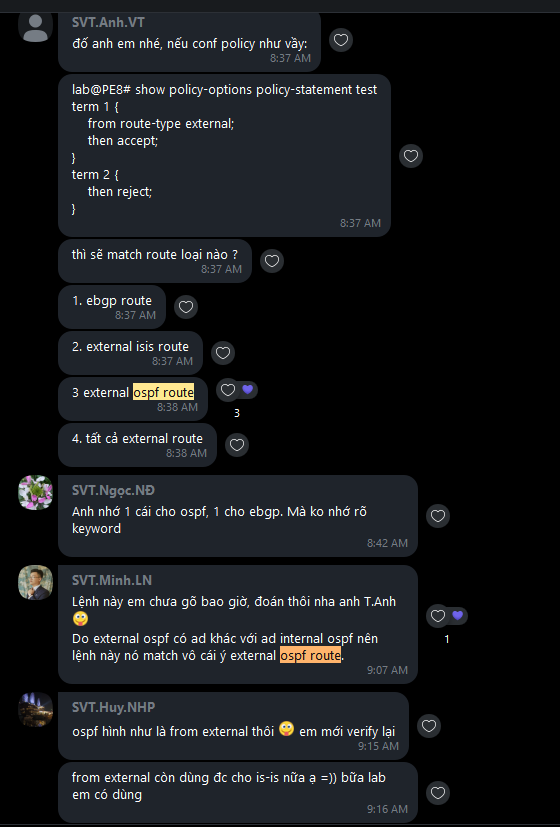
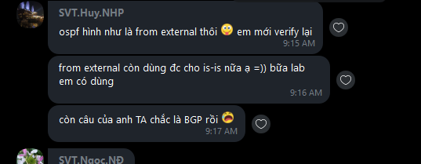

# policy-statement from route-type external vs from external

[ Wednesday, August 25, 2021 8:37 AM ] ⁨SVT.Anh.VT⁩: đố anh em nhé, nếu conf policy như vầy:

[ Wednesday, August 25, 2021 8:37 AM ] ⁨SVT.Anh.VT⁩: lab@PE8# show policy-options policy-statement test

term 1 {

    from route-type external;

    then accept;

}

term 2 {

    then reject;

}

[ Wednesday, August 25, 2021 8:37 AM ] ⁨SVT.Anh.VT⁩: thì sẽ match route loại nào ?

[ Wednesday, August 25, 2021 8:37 AM ] ⁨SVT.Anh.VT⁩: 1. ebgp route

[ Wednesday, August 25, 2021 8:37 AM ] ⁨SVT.Anh.VT⁩: 2. external isis route

[ Wednesday, August 25, 2021 8:38 AM ] ⁨SVT.Anh.VT⁩: 3 external ospf route

[ Wednesday, August 25, 2021 8:38 AM ] ⁨SVT.Anh.VT⁩: 4. tất cả external route

[ Wednesday, August 25, 2021 8:42 AM ] ⁨SVT.Ngọc.NĐ⁩: Anh nhớ 1 cái cho ospf, 1 cho ebgp. Mà ko nhớ rõ keyword

[ Wednesday, August 25, 2021 9:07 AM ] ⁨SVT.Minh.LN⁩: Lệnh này em chưa gõ bao giờ, đoán thôi nha anh T.Anh (yummi)

Do external ospf có ad khác với ad internal ospf nên lệnh này nó match vô cái ý external ospf route.

[ Wednesday, August 25, 2021 9:15 AM ] ⁨SVT.Huy.NHP⁩: ospf hình như là from external thôi (yummi) em mới verify lại

[ Wednesday, August 25, 2021 9:16 AM ] ⁨SVT.Huy.NHP⁩: from external còn dùng đc cho is-is nữa ạ =)) bữa lab em có dùng

[ Wednesday, August 25, 2021 9:17 AM ] ⁨SVT.Huy.NHP⁩: còn câu của anh TA chắc là BGP rồi (cry)

---

